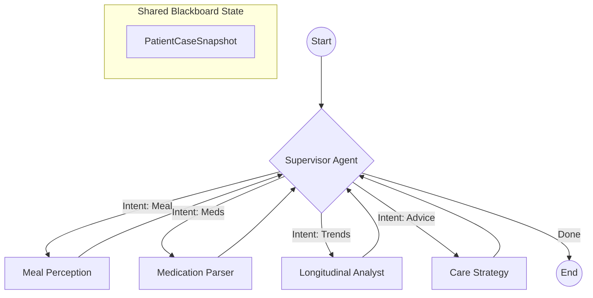

# Architecture

## Purpose
This is the canonical architecture reference for CarePilot. It describes the feature-first modular-monolith structure, the ownership boundaries that contributors must preserve, and the forward direction for the project.

Related docs:
- `README.md`
- `docs/refactor_plan.md` — detailed refactor history and current status
- `docs/REFACTOR_HISTORY.md` — log of completed architectural phases
- `docs/prompt_catalog.md` — repository of all agent prompts

---

## System Shape

CarePilot is a **feature-first modular monolith**: one codebase, strict layer ownership, no shared mutable globals. All work targets the canonical surfaces below.

```
src/care_pilot/
├── features/      product behavior and business entrypoints
├── agent/         bounded model-powered reasoning nodes
├── platform/      infrastructure and runtime adapters
├── core/          shared primitives and contracts
└── config/        settings composition root
```

### Repo-Wide Architecture Stance (Hard Decisions)
- **Features** own product behavior and deterministic domain rules.
- **Agent** owns model-backed reasoning (pydantic-ai).
- **Orchestration** is supervisor-led via **LangGraph**.
- **Platform** owns infra-only adapters.
- **Core** owns only tiny cross-cutting primitives and API contracts.

---

## Layers

### Interface Layer — `apps/web/`
- Next.js 14 app router; robust data fetching via **TanStack Query**.
- Optimized for low-latency via dynamic component loading and `content-visibility`.

### API Layer — `apps/api/carepilot_api/`
- Owns HTTP transport, session auth, and policy enforcement.
- **Thin Routers**: Handlers are transport-only. Deep orchestration logic is deferred to the Feature layer.

### Inference Layer — `apps/inference/run.py`
- Standalone microservice offloading heavy model execution (Whisper, BERT, Emotion) from the main API.
- Unified async runtime for speech and text emotion inference.
- Enables horizontal scaling of AI capabilities independent of the business logic.

### Persistence Layer — `src/care_pilot/platform/persistence/`
- **Schema Management**: Managed exclusively via **Alembic** migrations.
- **Relational Integrity**: Uses **SQLModel** for structured relational storage.
- **Normalization**: User profiles, nutrition goals, and meal schedules are stored in dedicated tables to ensure data integrity and query efficiency.
- **Backwards Compatibility**: The repository layer provides a bridging facade to support both legacy JSON-dumped records and new relational structures.

### Feature Layer — `src/care_pilot/features/`
- Owns all product behavior.
- **Workflows**: Coordinate multi-agent journeys using **LangGraph**.
- **Blackboard Model**: Uses `PatientCaseSnapshot` as a shared state object that agents read from and contribute to.

### Agent Layer — `src/care_pilot/agent/`
- Bounded reasoning nodes.
- **Supervisor Agent**: Top-level orchestrator node that interprets intent and routes to specialists.
- **Specialist Agents**: Perception (Meal, Meds) and Reasoning (Trend, Adherence, Care Plan) nodes.
- Agents return structured **`AgentResponse`** with proposed actions and recommendations.

---

## Multi-Agent Orchestration

CarePilot uses a **Supervisor-led LangGraph** architecture.



### Strategic Rules:
1. **Agents Propose, Features Execute**: Agents return `AgentAction` objects; feature workflows validate and commit them.
2. **Deterministic Safety**: Safety filters run after agent reasoning but before user delivery.
3. **Traceability**: All agent reasoning steps are captured in `reasoning_trace` for observability.

---

## Validation Gates

All contributions must pass the following check suite:
- `uv run ruff check .` - Linting and formatting.
- `uv run ty check .` - Static type safety.
- `uv run pytest -q` - Functional correctness.
- `pnpm web:typecheck` - Frontend integrity.
