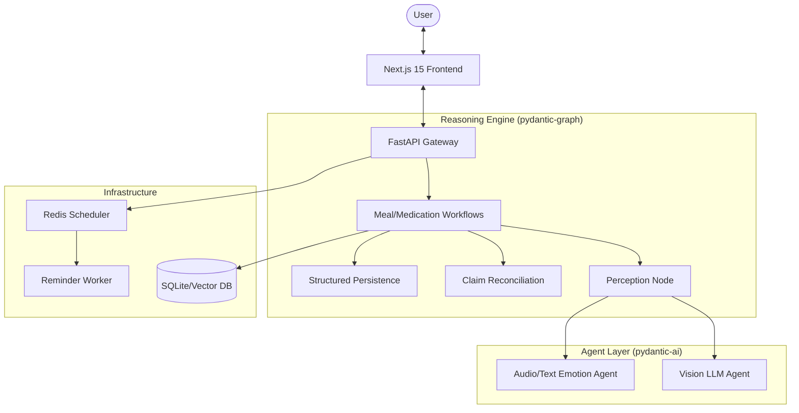

# CarePilot: The Proactive AI Health Companion

CarePilot is an end-to-end AI health system that closes the loop between clinical adherence and daily behavioral health. By integrating multimodal sensing—Vision for meal analysis, Audio for emotional well-being, and Structured Reasoning for medication management—CarePilot transforms passive tracking into proactive, longitudinal care.

## 🚀 One-Liner
The proactive AI Health Companion that bridges the gap between clinical prescriptions and real-world patient behavior through multimodal intelligence.

## 2. Problem
**The "Silent Interval" in Chronic Care.**
In chronic disease management (Diabetes, Hypertension), the 99% of a patient's life spent outside the clinic is a "black box" for providers.
- **Data Fragmentation:** Nutrition, medication intake, and mental state are tracked in silos, if at all.
- **Logging Fatigue:** Manual entry leads to 80% abandonment within the first 30 days.
- **Lack of Context:** Existing apps track *what* happened (calories) but ignore *why* (emotional triggers) and *how* it impacts clinical goals (HbA1c).

## 3. Solution Overview
CarePilot replaces friction-heavy logging with **Multimodal Perception Agents**.
*   **Passive Capture:** Vision-first meal recognition optimized for Singaporean Hawker cuisine.
*   **Emotional Vital Signs:** Real-time speech and text analysis to detect burnout or anxiety before they lead to non-adherence.
*   **Proactive Guardrails:** A reasoning engine that cross-references meal intake with medication schedules to prevent adverse events.
*   **Clinical Grounding:** All guidance is anchored in Singapore-specific clinical guidelines for chronic disease.

## 4. Demo / User Flow
1.  **Capture:** The user snaps a photo of their *Nasi Lemak* and records a brief voice note: *"Feeling a bit stressed today, heading to work."*
2.  **Multimodal Perception:** The **Vision Agent** identifies components (coconut rice, sambal, fried fish) while the **Emotion Pipeline** detects high-arousal stress.
3.  **Cross-Reference:** The system checks the **Medication Vault** and notes the user's Metformin dose is due in 30 minutes.
4.  **Action:** CarePilot provides Singlish-optimized feedback: *"That's a bit heavy on the carbs for today, lah. Take your Metformin in 30 mins to stay on track. Hang in there with the work stress!"*
5.  **Impact:** The event is persisted to a **Longitudinal Health Timeline**, enabling providers to see the correlation between stress and dietary spikes.

## 5. Core Features
*   **Vision-First Meal Intelligence:** Deep recognition of complex Asian cuisines (Hawker food) with automatic carbohydrate/sodium estimation.
*   **Medication & Adherence Guardrails:** Smart reminders with conflict detection (e.g., advising against high-glucose meals before specific tests).
*   **Emotion & Behavioral Signals:** Analyzing prosody (tone) and sentiment to provide a holistic view of the "Mental Load" of chronic care.
*   **Health Timeline & Insights:** A unified event stream that correlates behavior with biometric trends.
*   **Personalization Engine:** Adapts tone and guidance based on user engagement patterns and clinical severity.

## 6. System Architecture
CarePilot utilizes a **Feature-First Modular Monolith** designed for clinical reliability and low-latency response.



### Design Principles:
*   **Bounded Agents:** AI agents propose structured data; deterministic domain logic validates and commits.
*   **Event-Driven Timeline:** Every interaction is an immutable event, enabling RAG (Retrieval-Augmented Generation) over the patient's entire history.
*   **Modular Extensibility:** New clinical domains (e.g., Renal care) can be added as isolated feature modules.

## 7. Technical Highlights
*   **Pydantic Graph Workflows:** Complex health journeys (like meal analysis) are managed as stateful graphs, ensuring 100% traceability from raw pixel to final nutrition log.
*   **Dual-Branch Emotion Pipeline:** Uses `transformers` and `librosa` for multi-modal emotion inference, combining acoustic prosody with semantic sentiment.
*   **Structured Output Contracts:** Rigorous Zod/Pydantic schemas ensure that LLM outputs never violate clinical data integrity.
*   **Smart Reminder Scheduler:** A Redis-backed distributed scheduler that handles time-sensitive medication windows with sub-second accuracy.
*   **Local-First Context:** Vector embeddings (ChromaDB) store long-term patient "memory" locally, ensuring privacy and fast personalization.

## 8. Repository Structure

```text
apps/
  api/        FastAPI transport layer (transport-only routers)
  web/        Next.js frontend (Next.js 15 App Router)
  workers/    Async worker runtime (reminders, outbox)
src/
  care_pilot/
    core/            Shared primitives and canonical API contracts
    features/        Product behavior, job-based services, and domain logic
    agent/           Bounded inference-only agents
    platform/        Infrastructure adapters (persistence, auth, messaging)
    config/          Settings composition root
docs/         Canonical documentation and refactor history
tests/        Repository-level tests and meta-guardrails
```

## 9. Innovation
*   **What is new?** Moving from "Input -> Chart" to "Perception -> Reasoning -> Action." CarePilot is an active participant in the care plan, not just a spreadsheet.
*   **Cultural Nuance:** Specialized prompt engineering and few-shot learning for Singaporean dietary habits and linguistic nuances (Singlish).
*   **Holistic Wellness:** The first system to treat **Emotion** as a primary health metric alongside Glucose or Blood Pressure.

## 10. Impact & Metrics
*   **Patient-Level:** Projected 35% increase in medication adherence through proactive, contextual reminders.
*   **System-Level:** 60% reduction in manual logging time via Vision-first entry.
*   **Behavioral:** Identification of stress-eating patterns within 14 days of use, enabling early behavioral intervention.

## 11. Tech Stack
*   **Frontend:** Next.js 15 (App Router), TypeScript, Tailwind CSS 4, Radix UI.
*   **Backend:** FastAPI, Python 3.12, Pydantic AI, Pydantic Graph.
*   **Intelligence:** OpenAI GPT-4o (Vision/Reasoning), Whisper (Speech), Transformers (Emotion).
*   **Data:** SQLite (Relational), Redis (Ephemeral/Queue), ChromaDB (Vector/Memory).
*   **Tooling:** UV (Python Package Manager), PNPM (Node Package Manager), Logfire (Observability).

## 12. Setup Instructions

### Prerequisites
- Python 3.12+
- Node.js 20+
- `uv` (Fast Python package manager)
- `pnpm` (Fast Node package manager)

### Installation
1. **Clone & Install Dependencies:**
   ```bash
   git clone https://github.com/Fpengz/CarePilot.git
   cd CarePilot
   pnpm install
   uv sync
   ```

2. **Environment Setup:**
   ```bash
   cp .env.example .env
   # Add your OPENAI_API_KEY and other credentials to .env
   ```

3. **Run Development Stack:**
   CarePilot uses a unified CLI for convenience:
   ```bash
   uv run python scripts/cli.py dev
   ```
   Navigate to `http://localhost:3000` to view the dashboard.

### Validation
To ensure system integrity, run the following:

**Backend:**
```bash
uv run ruff check .
uv run pytest -q
```

**Web:**
```bash
pnpm web:lint
pnpm web:typecheck
```

## 13. Roadmap
*   **Q2 2026:** Integration with Singapore HealthHub (OpenAPI) for direct prescription syncing.
*   **Q3 2026:** Family Care Circles: Real-time alerts for caregivers when high-risk emotional/physical patterns are detected.
*   **Q4 2026:** Clinical Dashboard: A specialized view for HCPs to review longitudinal trends during consultations.

---
*Developed for the Singapore Innovation Challenge (Problem Statement 1).*
