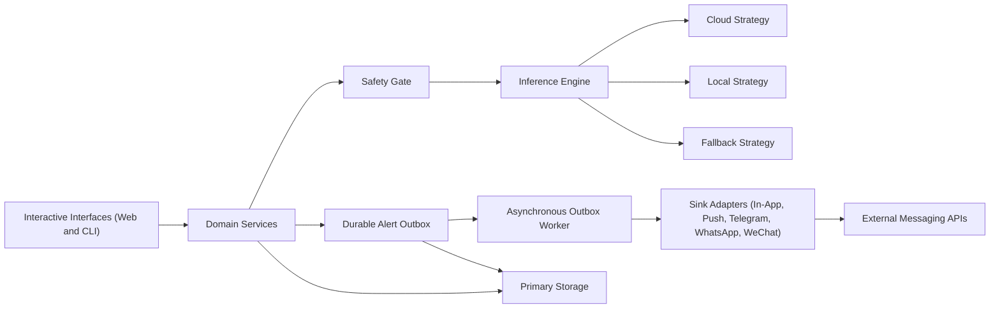
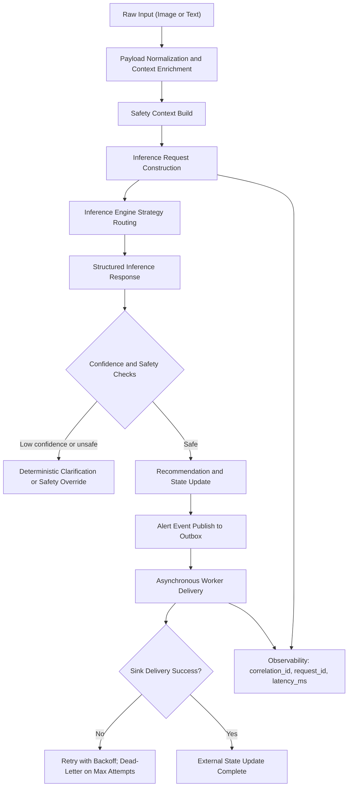

# Dietary Guardian SG

## Overview
Dietary Guardian SG is a clinical-oriented dietary and medication support system for older adults managing chronic conditions. The platform combines meal recognition, medication reminder workflows, report parsing, and safety checks in a local-first architecture.

## Environment Setup
### Prerequisites
- Python 3.12+
- [uv](https://github.com/astral-sh/uv)

### Install Dependencies
```bash
uv sync
```

### Configure Environment Variables
Copy `.env.example` to `.env` and update values for your environment.

```bash
cp .env.example .env
```

Required keys for cloud usage:
- `GEMINI_API_KEY` (or `GOOGLE_API_KEY`)
- `LLM_PROVIDER=gemini`

Required keys for local usage:
- `LLM_PROVIDER=ollama` or `LLM_PROVIDER=vllm`
- `LOCAL_LLM_BASE_URL` (or `OLLAMA_BASE_URL`)

## Configuration Validation
### Runtime Settings
The project uses `pydantic-settings` with `.env` support and runtime validation.

Configuration source of truth:
- `src/dietary_guardian/config/settings.py`
- accessor: `get_settings()`

Validation behavior:
- If `LLM_PROVIDER=gemini`, one of `GEMINI_API_KEY` or `GOOGLE_API_KEY` must be set.
- If `LLM_PROVIDER` is `ollama` or `vllm`, a local base URL must be set.
- `OLLAMA_BASE_URL` is normalized into `LOCAL_LLM_BASE_URL` for compatibility.

## Running the Application
### Streamlit UI
```bash
./tools/run_dev.sh
```

### CLI Scenario Runner
```bash
uv run python src/main.py
```

## Runtime Modes and Environment Matrix
### Gemini Mode
- `LLM_PROVIDER=gemini`
- `GEMINI_API_KEY` or `GOOGLE_API_KEY`
- Optional: `GEMINI_MODEL`

### Local Ollama Mode
- `LLM_PROVIDER=ollama`
- `LOCAL_LLM_BASE_URL` or `OLLAMA_BASE_URL`
- Optional: `LOCAL_LLM_MODEL`, `LOCAL_LLM_API_KEY`

### Local vLLM Mode
- `LLM_PROVIDER=vllm`
- `LOCAL_LLM_BASE_URL`
- Optional: `LOCAL_LLM_MODEL`, `LOCAL_LLM_API_KEY`

## Notification Channel Configuration
### Telegram
```bash
export TELEGRAM_BOT_TOKEN="<token>"
export TELEGRAM_CHAT_ID="<chat_id>"
export TELEGRAM_DEV_MODE="1"
```

When `TELEGRAM_DEV_MODE=1`, Telegram delivery returns a deterministic success path without issuing a live network request.

## Pre-commit Setup
### Install Hooks
```bash
uv run pre-commit install
```

### Commit Message Standard
This repository follows Conventional Commits. Use:
- `<type>(<scope>): <subject>`
- Allowed types: `feat`, `fix`, `docs`, `style`, `refactor`, `perf`, `test`, `build`, `ci`, `chore`, `revert`

Set the local git template once:
```bash
git config commit.template .gitmessage
```

### Hook Behavior
The local pre-commit configuration runs these checks on every commit:
- `tools/precommit_ruff.sh` -> `uv run ruff check .`
- `tools/precommit_ty.sh` -> `uv run ty check . --extra-search-path src --output-format concise`

### Local Developer Scripts
- `./tools/run_dev.sh` starts Streamlit with the `watchdog` file watcher and save-triggered reload.
- `./tools/run_test.sh` runs lint, type checks, and tests.

## Quality Gates
Run these checks before submitting changes:

```bash
./tools/run_test.sh
uv run ruff check .
uv run ty check . --extra-search-path src --output-format concise
uv run pytest -q
```

## Troubleshooting
### Configuration Validation Errors
If startup fails with configuration validation:
1. Confirm `.env` exists.
2. Confirm provider-specific required keys are set.
3. Re-run with explicit provider values to isolate missing keys.

### Module Import Errors
If imports fail in local scripts, run through `uv` and ensure dependencies are synced:

```bash
uv sync
uv run pytest -q
```

## Roadmap
### Phase 1: Environment Profile Support
- Add `.env.development` and `.env.production` loading patterns.
- Integrate a managed secret backend.

### Phase 2: Configuration Telemetry
- Emit redacted runtime configuration fingerprints at startup.
- Add structured diagnostics for provider selection and endpoint routing.

### Phase 3: CI and Local Workflow Parity
- Run pre-commit hooks in CI with identical commands and flags.
- Gate merges on lint, type, and test parity.

### Phase 4: Runtime Health Endpoint
- Expose a non-sensitive configuration health status endpoint.
- Surface provider readiness and key validation state.

### Phase 5: Policy-Driven Feature Flags
- Introduce policy-based toggles for role tools and model routing.
- Add validated feature flag schemas and rollout guards.

## Architecture-as-Code
### System Topology


### Data Lifecycle

