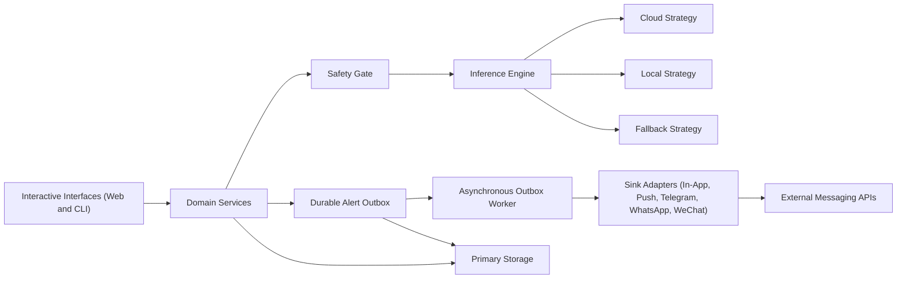
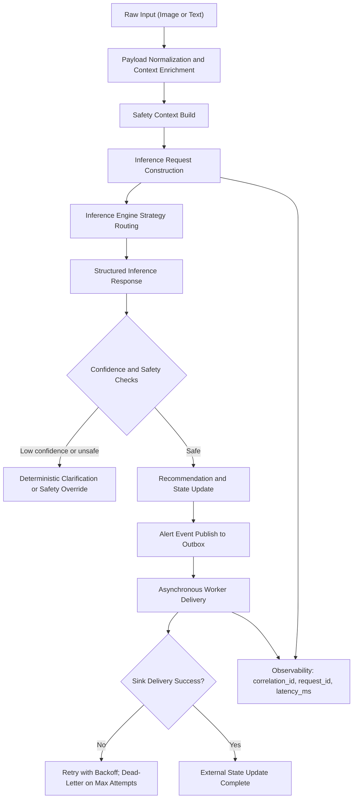

# Dietary Guardian SG

## Overview
Dietary Guardian SG is a dietary and medication support system for both:
- people managing chronic conditions, and
- general wellness users who want help with daily health routines.

The platform combines meal recognition, medication reminder workflows, report parsing, safety checks, and an adaptive meal recommendation agent in a local-first architecture.

## Identity and Access Model
The system now separates authorization and user persona:
- `account_role`: `member` or `admin` (authorization / RBAC)
- `profile_mode`: `self` or `caregiver` (UX mode / care context)

Privileged APIs (alerts/workflow inspection) are gated by **scopes**, not persona labels.
Policy enforcement is now action-based in API routes (for example `meal.analyze`, `auth.sessions.revoke`) with centralized scope checks.

See `docs/rbac-matrix.md` for the current RBAC matrix and endpoint permissions.
See `docs/api-auth-contract.md` for auth payload examples and migration notes.
See `docs/api-recommendation-agent-contract.md` for the adaptive meal agent API, substitution flow, and feedback loop contract.
See `ARCHITECTURE.md` for the canonical system architecture and extension model.
See `docs/archive/architecture/architecture-v1.md` for the historical v1 architecture snapshot.
See `docs/feature-audit.md` for the current capability audit.
See `docs/config-reference.md` for backend environment variables and defaults.
See `docs/nightly-ops.md` for the nightly autonomous build runbook.
See `SAFETY.md` for medical safety guardrails and escalation rules.

### Demo API Accounts
- `member@example.com` / `member-pass`
- `helper@example.com` / `helper-pass`
- `admin@example.com` / `admin-pass`

## Environment Setup
### Prerequisites
- Python 3.12+
- [uv](https://github.com/astral-sh/uv)

### Install Dependencies
```bash
uv sync
pnpm install
```

### Configure Environment Variables
Copy `.env.example` to `.env` and update values for your environment.

```bash
cp .env.example .env
```

Environment precedence:
- Default source of truth: root `.env`
- Optional web-only override: `apps/web/.env` (overrides root values for web commands only)

Required keys for cloud usage:
- `GEMINI_API_KEY` (or `GOOGLE_API_KEY`)
- `LLM_PROVIDER=gemini`

Or for OpenAI cloud usage:
- `OPENAI_API_KEY`
- `LLM_PROVIDER=openai`
- Optional: `OPENAI_MODEL`, `OPENAI_BASE_URL`

Required keys for local usage:
- `LLM_PROVIDER=ollama` or `LLM_PROVIDER=vllm`
- `LOCAL_LLM_BASE_URL` (or `OLLAMA_BASE_URL`)

Auth backend defaults (v1):
- `API_SQLITE_DB_PATH=dietary_guardian_api.db` (application data / households / API persistence)
- `AUTH_STORE_BACKEND=sqlite` (default)
- `AUTH_SQLITE_DB_PATH=dietary_guardian_auth.db` (auth/accounts/sessions/audit)

Platform runtime toggles:
- `APP_ENV=dev|staging|prod`
- `APP_DATA_BACKEND=sqlite` or `postgres`
- `HOUSEHOLD_STORE_BACKEND=sqlite` or `postgres`
- `EPHEMERAL_STATE_BACKEND=in_memory` or `redis`
- `POSTGRES_DSN` for PostgreSQL-backed runtime paths
- `REDIS_URL` for Redis-backed cache / coordination paths
- `REDIS_KEYSPACE_VERSION=v1|v2` for Redis key naming strategy during migration windows
- `TOOL_POLICY_ENFORCEMENT_MODE=shadow|enforce` for DB-backed tool policy rollout
- `WORKFLOW_CONTRACT_BOOTSTRAP=1|0` to enable/disable startup runtime-contract snapshot bootstrap
- `READINESS_FAIL_ON_WARNINGS=0|1` (defaults by profile)
- `REQUIRED_PROVIDER` optional readiness expectation for deployments

## Configuration Validation
### Runtime Settings
The project uses `pydantic-settings` with `.env` support and runtime validation.

Configuration source of truth:
- `src/dietary_guardian/config/settings.py`
- accessor: `get_settings()`

Validation behavior:
- If `LLM_PROVIDER=gemini`, one of `GEMINI_API_KEY` or `GOOGLE_API_KEY` must be set.
- If `LLM_PROVIDER=openai`, `OPENAI_API_KEY` must be set.
- If `LLM_PROVIDER` is `ollama` or `vllm`, a local base URL must be set.
- `OLLAMA_BASE_URL` is normalized into `LOCAL_LLM_BASE_URL` for compatibility.

## Running the Application
### Quickstart (API + Web)
Use the unified scripts CLI (recommended):

```bash
uv run python scripts/dg.py dev
```

Optional flags:
- `uv run python scripts/dg.py dev --no-web` (API only)
- `uv run python scripts/dg.py dev --no-api` (Web only)
- `uv run python scripts/dg.py dev --no-scheduler` (API+Web without reminder scheduler)

Endpoints:
- Web: `http://localhost:3000`
- API docs: `http://localhost:8001/docs`

Show all script commands:

```bash
uv run python scripts/dg.py help
```

### API Only (FastAPI)
```bash
uv run python -m apps.api.run
```

### Local PostgreSQL + Redis Infra
Bring up the target-aligned local infra services:

```bash
uv run python scripts/dg.py infra up
```

If Docker Compose is unavailable, the script automatically falls back to plain `docker run` containers.
Docker daemon must be running before invoking infra scripts.

Useful infra commands:

```bash
uv run python scripts/dg.py infra status
uv run python scripts/dg.py infra logs
uv run python scripts/dg.py infra down
```

Bootstrap PostgreSQL schema (defaults to the local compose DSN):

```bash
uv run python scripts/dg.py migrate postgres
```

Dry-run Redis keyspace migration (v1 -> v2 naming):

```bash
uv run python scripts/dg.py migrate redis-keyspace --redis-url redis://127.0.0.1:6379/0
```

Run the external worker loop:

```bash
pnpm dev:worker
```

Run a full PostgreSQL + Redis smoke (infra + migration + API + worker + reminder delivery):

```bash
uv run python scripts/dg.py smoke postgres-redis
```

Run a readiness gate against a running API:

```bash
uv run python scripts/dg.py readiness http://127.0.0.1:8001
```

Note: by default, application data and auth data are persisted in SQLite via:
- `API_SQLITE_DB_PATH`
- `AUTH_SQLITE_DB_PATH`
Set `AUTH_STORE_BACKEND=in_memory` for ephemeral demo/test runs.

### Web Only (Next.js)
```bash
pnpm web:dev
```

`pnpm web:*` commands automatically load root `.env` and then apply optional `apps/web/.env` overrides.

### Web + API Proxy Contract (Dev)
- Browser calls should use `NEXT_PUBLIC_API_BASE_URL=/backend` (same-origin proxy route).
- Next route handler `apps/web/app/backend/[...path]/route.ts` forwards to `BACKEND_API_BASE_URL`.
- Set `NEXT_ALLOWED_DEV_ORIGINS` to include LAN hostnames used in development.
- Set `API_CORS_ORIGINS` to include matching web origins.

### Streamlit UI
```bash
./tools/run_dev.sh
```

### CLI Scenario Runner
```bash
uv run python src/main.py
```

## Scripts CLI
Primary scripts interface:

```bash
uv run python scripts/dg.py <command>
```

Common commands:
- `uv run python scripts/dg.py dev`
- `uv run python scripts/dg.py infra up`
- `uv run python scripts/dg.py migrate postgres`
- `uv run python scripts/dg.py migrate redis-keyspace --redis-url <REDIS_URL> [--apply]`
- `uv run python scripts/dg.py smoke postgres-redis`
- `uv run python scripts/dg.py readiness http://127.0.0.1:8001`
- `uv run python scripts/dg.py test backend`
- `uv run python scripts/dg.py test web`
- `uv run python scripts/dg.py test comprehensive`
- `uv run python scripts/dg.py report nightly`
- `uv run python scripts/dg.py web env -- pnpm --dir apps/web dev`

## Runtime Modes and Environment Matrix
### Gemini Mode
- `LLM_PROVIDER=gemini`
- `GEMINI_API_KEY` or `GOOGLE_API_KEY`
- Optional: `GEMINI_MODEL`

### OpenAI Mode
- `LLM_PROVIDER=openai`
- `OPENAI_API_KEY`
- Optional: `OPENAI_MODEL`, `OPENAI_BASE_URL`, `OPENAI_REQUEST_TIMEOUT_SECONDS`, `OPENAI_TRANSPORT_MAX_RETRIES`

### Local Ollama Mode
- `LLM_PROVIDER=ollama`
- `LOCAL_LLM_BASE_URL` or `OLLAMA_BASE_URL`
- Optional: `LOCAL_LLM_MODEL`, `LOCAL_LLM_API_KEY`

### Local vLLM Mode
- `LLM_PROVIDER=vllm`
- `LOCAL_LLM_BASE_URL`
- Optional: `LOCAL_LLM_MODEL`, `LOCAL_LLM_API_KEY`

## Notification Channel Configuration
### Telegram
```bash
export TELEGRAM_BOT_TOKEN="<token>"
export TELEGRAM_CHAT_ID="<chat_id>"
export TELEGRAM_DEV_MODE="1"
```

When `TELEGRAM_DEV_MODE=1`, Telegram delivery returns a deterministic success path without issuing a live network request.

### Email
```bash
export EMAIL_DEV_MODE="1"
export EMAIL_SMTP_HOST="smtp.example.com"
export EMAIL_SMTP_PORT="587"
export EMAIL_SMTP_USERNAME="smtp-user"
export EMAIL_SMTP_PASSWORD="smtp-pass"
export EMAIL_SMTP_USE_TLS="1"
export EMAIL_FROM_ADDRESS="noreply@example.com"
```

When `EMAIL_DEV_MODE=1`, reminder email delivery is simulated but still recorded in reminder notification logs.

### SMS
```bash
export SMS_DEV_MODE="1"
export SMS_WEBHOOK_URL="https://sms-provider.example/send"
export SMS_API_KEY="<token>"
export SMS_SENDER_ID="DietaryGuardian"
```

When `SMS_DEV_MODE=1`, SMS delivery is simulated but still recorded in reminder notification logs.

### Reminder Scheduler
- `pnpm dev` starts the API, web app, and the reminder scheduler loop.
- Disable the scheduler in dev with `uv run python scripts/dg.py dev --no-scheduler`.
- Alternative env toggle remains supported: `START_REMINDER_SCHEDULER=0 uv run python scripts/dg.py dev`.
- Run the scheduler alone with `pnpm dev:scheduler`.
- Scheduler tuning:
  - `REMINDER_SCHEDULER_INTERVAL_SECONDS`
  - `REMINDER_SCHEDULER_BATCH_SIZE`

## Pre-commit Setup
### Install Hooks
```bash
uv run pre-commit install
```

### Commit Message Standard
This repository follows Conventional Commits. Use:
- `<type>(<scope>): <subject>`
- Allowed types: `feat`, `fix`, `docs`, `style`, `refactor`, `perf`, `test`, `build`, `ci`, `chore`, `revert`

Set the local git template once:
```bash
git config commit.template .gitmessage
```

### Hook Behavior
The local pre-commit configuration runs these checks on every commit:
- `tools/precommit_ruff.sh` -> `uv run ruff check .`
- `tools/precommit_ty.sh` -> `uv run ty check . --extra-search-path src --output-format concise`

### Local Developer Scripts
- `./tools/run_dev.sh` starts Streamlit with the `watchdog` file watcher and save-triggered reload.
- `./tools/run_test.sh` runs lint, type checks, and tests.
- `./tools/validate.sh backend-milestone` runs the targeted backend milestone checks (sqlite auth + household/auth API coverage).
- `./tools/validate.sh backend-all` runs repo backend checks (`ruff`, `ty`, `pytest`).
- `./tools/validate.sh full-stack` runs backend checks plus web typecheck/build.
- `uv run python scripts/dg.py report nightly` creates (or prints) `reports/nightly_YYYY-MM-DD.md` from the report template.

## Nightly Workflow
For autonomous nightly progress, follow the repo-specific runbook:

- `docs/nightly-ops.md` (loop, milestone selection, validation, report requirements)
- `reports/nightly_TEMPLATE.md` (required report sections)

Generate tonight's report file:

```bash
uv run python scripts/dg.py report nightly
```

## Quality Gates
Run this unified comprehensive gate before submitting changes:

```bash
uv run python scripts/dg.py test comprehensive
```

Optional variants:
- `uv run python scripts/dg.py test comprehensive --skip-e2e`
- `uv run python scripts/dg.py test comprehensive --skip-smoke`
- `uv run python scripts/dg.py test backend`
- `uv run python scripts/dg.py test web`

Equivalent manual commands:

```bash
./tools/run_test.sh
uv run ruff check .
uv run ty check . --extra-search-path src --output-format concise
uv run pytest -q
pnpm web:lint
pnpm web:typecheck
pnpm --dir apps/web test:e2e
```

## Versioning and Release Process
This repo uses modern VCS-driven versioning for Python and Changesets-driven semver workflows for the monorepo.

Python package versioning:
- `pyproject.toml` uses Hatch + Hatch VCS (`tool.hatch.version.source = "vcs"`).
- Package version is derived from Git tags.
- Create release tags in semver format: `vX.Y.Z` (example: `v1.4.0`).

Monorepo release planning:
- `pnpm version:plan` to create a changeset entry for a change.
- `pnpm version:status` to inspect pending version bumps.
- `pnpm version:bump` to apply version/changelog updates from pending changesets.
- `pnpm version:release` to publish via Changesets.

Recommended sequence:
1. Add changeset entries while developing (`pnpm version:plan`).
2. Before release, run full validation (`pnpm validate:full`).
3. Apply version updates (`pnpm version:bump`) and commit.
4. Create and push release tag (`git tag vX.Y.Z && git push origin vX.Y.Z`).

## Troubleshooting
### Configuration Validation Errors
If startup fails with configuration validation:
1. Confirm `.env` exists.
2. Confirm provider-specific required keys are set.
3. Re-run with explicit provider values to isolate missing keys.

### Module Import Errors
If imports fail in local scripts, run through `uv` and ensure dependencies are synced:

```bash
uv sync
uv run pytest -q
```

For the FastAPI app, prefer module mode from the repo root:

```bash
uv run python -m apps.api.run
```

## Roadmap
See `docs/roadmap-v1.md` for the full canonical roadmap.
See `docs/feature-audit.md` for the current capability verification and gap summary.
See `SYSTEM_ROADMAP.md` for roadmap index pointers.

Feature matrix snapshot:

| Feature | Status |
|---|---|
| Health profile gradual guidance (interactive Q&A) | `**[Complete]**` |
| Nutritional deficiency inference from meal preferences | `**[Complete]**` |
| Meal intake tracking with real-time updates | `**[Complete]**` |
| Community-based caregiving support | `**[Complete]**` |
| Environmental monitoring (air quality / conditions) | `**[Research]**` |
| Demographic context awareness (fairness/privacy constrained) | `**[Research]**` |
| Periodic mobility reminders | `**[Complete]**` |
| Medication tracking + adherence metrics | `**[Complete]**` |
| Symptom check-ins | `**[Complete]**` |
| Patient to doctor clinical card generation | `**[Complete]**` |
| Numerical data change analysis | `**[Complete]**` |

Roadmap horizon detail, goal labels, and milestone breakdown are maintained only in `docs/roadmap-v1.md`.

## Architecture-as-Code
### System Topology


### Data Lifecycle

