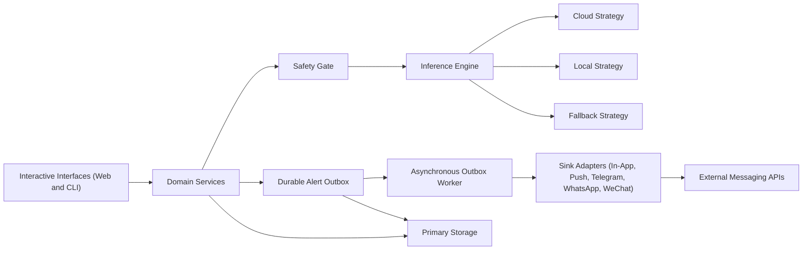
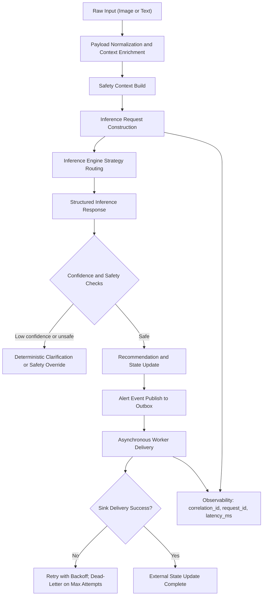

# Dietary Guardian SG

## Overview
Dietary Guardian SG is a dietary and medication support system for both:
- people managing chronic conditions, and
- general wellness users who want help with daily health routines.

The platform combines meal recognition, medication reminder workflows, report parsing, and safety checks in a local-first architecture.

## Identity and Access Model
The system now separates authorization and user persona:
- `account_role`: `member` or `admin` (authorization / RBAC)
- `profile_mode`: `self` or `caregiver` (UX mode / care context)

Privileged APIs (alerts/workflow inspection) are gated by **scopes**, not persona labels.

See `docs/rbac-matrix.md` for the current RBAC matrix and endpoint permissions.
See `docs/api-auth-contract.md` for auth payload examples and migration notes.
See `docs/architecture-v1.md` for the v1 target architecture (hexagonal + workflow orchestration).
See `docs/config-reference.md` for backend environment variables and defaults.

### Demo API Accounts
- `member@example.com` / `member-pass`
- `helper@example.com` / `helper-pass`
- `admin@example.com` / `admin-pass`

## Environment Setup
### Prerequisites
- Python 3.12+
- [uv](https://github.com/astral-sh/uv)

### Install Dependencies
```bash
uv sync
pnpm install
```

### Configure Environment Variables
Copy `.env.example` to `.env` and update values for your environment.

```bash
cp .env.example .env
```

Required keys for cloud usage:
- `GEMINI_API_KEY` (or `GOOGLE_API_KEY`)
- `LLM_PROVIDER=gemini`

Required keys for local usage:
- `LLM_PROVIDER=ollama` or `LLM_PROVIDER=vllm`
- `LOCAL_LLM_BASE_URL` (or `OLLAMA_BASE_URL`)

Auth backend defaults (v1):
- `AUTH_STORE_BACKEND=sqlite` (default)
- `AUTH_SQLITE_DB_PATH=dietary_guardian_auth.db`

## Configuration Validation
### Runtime Settings
The project uses `pydantic-settings` with `.env` support and runtime validation.

Configuration source of truth:
- `src/dietary_guardian/config/settings.py`
- accessor: `get_settings()`

Validation behavior:
- If `LLM_PROVIDER=gemini`, one of `GEMINI_API_KEY` or `GOOGLE_API_KEY` must be set.
- If `LLM_PROVIDER` is `ollama` or `vllm`, a local base URL must be set.
- `OLLAMA_BASE_URL` is normalized into `LOCAL_LLM_BASE_URL` for compatibility.

## Running the Application
### Quickstart (API + Web)
Use the unified dev script (recommended):

```bash
./scripts/dev.sh
```

Optional flags:
- `./scripts/dev.sh --no-web` (API only)
- `./scripts/dev.sh --no-api` (Web only)

Endpoints:
- Web: `http://localhost:3000`
- API docs: `http://localhost:8001/docs`

### API Only (FastAPI)
```bash
uv run python -m apps.api.run
```

Note: by default, auth/accounts/sessions are persisted in SQLite via `AUTH_SQLITE_DB_PATH`.
Set `AUTH_STORE_BACKEND=in_memory` for ephemeral demo/test runs.

### Web Only (Next.js)
```bash
pnpm web:dev
```

### Streamlit UI
```bash
./tools/run_dev.sh
```

### CLI Scenario Runner
```bash
uv run python src/main.py
```

## Runtime Modes and Environment Matrix
### Gemini Mode
- `LLM_PROVIDER=gemini`
- `GEMINI_API_KEY` or `GOOGLE_API_KEY`
- Optional: `GEMINI_MODEL`

### Local Ollama Mode
- `LLM_PROVIDER=ollama`
- `LOCAL_LLM_BASE_URL` or `OLLAMA_BASE_URL`
- Optional: `LOCAL_LLM_MODEL`, `LOCAL_LLM_API_KEY`

### Local vLLM Mode
- `LLM_PROVIDER=vllm`
- `LOCAL_LLM_BASE_URL`
- Optional: `LOCAL_LLM_MODEL`, `LOCAL_LLM_API_KEY`

## Notification Channel Configuration
### Telegram
```bash
export TELEGRAM_BOT_TOKEN="<token>"
export TELEGRAM_CHAT_ID="<chat_id>"
export TELEGRAM_DEV_MODE="1"
```

When `TELEGRAM_DEV_MODE=1`, Telegram delivery returns a deterministic success path without issuing a live network request.

## Pre-commit Setup
### Install Hooks
```bash
uv run pre-commit install
```

### Commit Message Standard
This repository follows Conventional Commits. Use:
- `<type>(<scope>): <subject>`
- Allowed types: `feat`, `fix`, `docs`, `style`, `refactor`, `perf`, `test`, `build`, `ci`, `chore`, `revert`

Set the local git template once:
```bash
git config commit.template .gitmessage
```

### Hook Behavior
The local pre-commit configuration runs these checks on every commit:
- `tools/precommit_ruff.sh` -> `uv run ruff check .`
- `tools/precommit_ty.sh` -> `uv run ty check . --extra-search-path src --output-format concise`

### Local Developer Scripts
- `./tools/run_dev.sh` starts Streamlit with the `watchdog` file watcher and save-triggered reload.
- `./tools/run_test.sh` runs lint, type checks, and tests.

## Quality Gates
Run these checks before submitting changes:

```bash
./tools/run_test.sh
uv run ruff check .
uv run ty check . --extra-search-path src --output-format concise
uv run pytest -q
```

## Troubleshooting
### Configuration Validation Errors
If startup fails with configuration validation:
1. Confirm `.env` exists.
2. Confirm provider-specific required keys are set.
3. Re-run with explicit provider values to isolate missing keys.

### Module Import Errors
If imports fail in local scripts, run through `uv` and ensure dependencies are synced:

```bash
uv sync
uv run pytest -q
```

For the FastAPI app, prefer module mode from the repo root:

```bash
uv run python -m apps.api.run
```

## Roadmap
See `docs/roadmap-v1.md` for the detailed v1 delivery breakdown.

### V1 Milestone 1: Auth, Signup, and Account Management
- Self-serve email/password signup (web + API) with immediate session login.
- Account profile updates, password changes, and session/device management.
- Persist auth/accounts/sessions in SQLite (single-node production-ish default).
- Admin auth audit view and backend filters for audit investigation.

### V1 Milestone 2: Meal Analysis (Working Daily Flow)
- Stable typed meal summary contract in `/api/v1/meal/analyze`.
- Better meal history browsing (pagination/filtering and shared household visibility).
- Richer workflow timeline/failure metadata for meal analysis debugging.
- Frontend meal experience polish (summary-first UI, records/history, manual review guidance).

### V1 Milestone 3: Suggestions (Reports -> Recommendations)
- Unified suggestions flow from report parsing to recommendation generation.
- Persisted suggestions history and reusable structured output for web UI.
- Shareable suggestions visibility for household members (read-only in v1).

### V1 Milestone 4: Household Basics (Apple Family-like Group)
- Household create/invite/join/leave flows.
- Household roles (`owner`, `member`) and member management.
- Shared visibility across meals, reminders, and suggestions.
- Web household management UI (create, invite code, member list, join flow).

### V1 Milestone 5: UI/UX Refinement and Stabilization
- Web-first onboarding polish (`signup -> login -> first meal/report`).
- Replace remaining debug-first panels with structured views.
- Mobile/desktop accessibility pass (focus, contrast, keyboard interactions).
- End-to-end smoke checks for core user journeys.

### Post-v1 Platform Roadmap
- Environment profile support (`.env.development`, `.env.production`) and secret management.
- Configuration telemetry and runtime diagnostics.
- CI/local workflow parity for lint/type/test gates.
- Runtime health endpoints and provider readiness checks.
- Policy-driven feature flags with validated schemas.

## Architecture-as-Code
### System Topology


### Data Lifecycle

