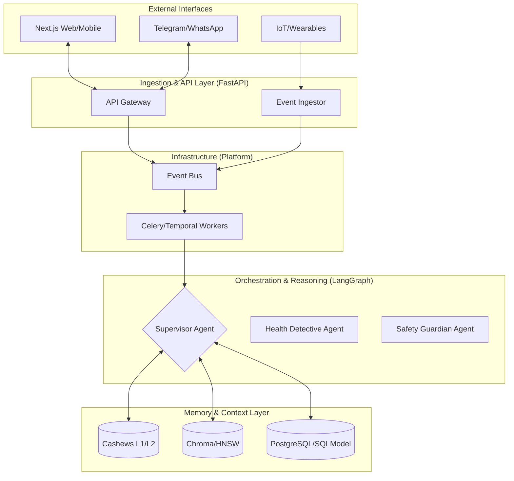

# CarePilot Strategic Architecture & Roadmap

## 1. Executive Summary
CarePilot is evolving from a reactive health chatbot into a proactive, low-latency (<100ms), and resilient AI Health Companion. This document serves as the **Single Source of Truth (SSoT)** for the engineering team, defining our architectural standards, performance budgets, and the 16-week execution path to production readiness.

### Core Mandate: Harness Design Principles
All implementations must strictly adhere to the Anthropic Harness Design Principles:
- **Explicit State:** System state must be externalized, versioned, and reconstructible (e.g., via the Event Timeline).
- **Resilience First:** Assume failure. Use circuit breakers, retries, and dead-letter queues at every integration point.
- **Intrinsic Observability:** Every reasoning step and system event must emit structured traces without manual instrumentation overhead.
- **Modular Pipelines:** Features are isolated "Feature Modules" with clear protocol-based boundaries.

---

## 2. Architectural Philosophy & Patterns

### 2.1 Hybrid Execution Model
We utilize a **Hybrid Execution Model** to balance high-volume data ingestion with complex, durable reasoning loops.

- **Event-Driven (NATS/Redis):** Handles high-volume, low-latency ingestion (e.g., sensor data, message webhooks).
- **Workflow Orchestration (LangGraph):** Manages stateful, multi-step agentic reasoning (e.g., "Health Detective" root cause analysis).

### 2.2 Hexagonal (Ports & Adapters) Architecture
Strict separation of **Core Domain Logic** from **Infrastructure Adapters**.
- `src/care_pilot/core`: Pure domain models and protocol definitions.
- `src/care_pilot/platform`: DB, Cache, Messaging, and LLM provider implementations.
- `src/care_pilot/features`: Business logic that coordinates core and platform.

### 2.3 System Diagram (Mermaid)

---

## 3. Performance Budget (<100ms Target)

To maintain a "proactive companion" feel, we operate under a strict sub-100ms latency budget for the critical path (input to first token/reaction).

| Component | Target Latency | Strategy |
| :--- | :--- | :--- |
| **Context Pruning** | <15ms | Relevance-based sliding window + L1 Caching |
| **Memory Retrieval** | <20ms | HNSW Indexing + Parallel Vector Search |
| **RL Inference** | <10ms | On-device/Edge Contextual Bandits |
| **LLM First Token** | <40ms | Semantic Routing + Speculative Decoding |
| **Network/Overhead** | <15ms | HTTP/3 + Optimized Serialization |
| **Total (P95)** | **<100ms** | **Parallel Execution & Async I/O** |

---

## 4. Advanced Agent Intelligence Stack

### 4.1 Agentic RAG
We move beyond simple vector search to a **Hybrid Retrieval** model:
- **Vector:** Semantic similarity (ChromaDB).
- **BM25:** Keyword exact match for medical terminology.
- **Knowledge Graph:** Relationship-aware retrieval (e.g., "Drug A affects Condition B").
- **Semantic Router:** Routes queries to the optimal retrieval path or specialist agent.

### 4.2 Specialized Agent Roles
- **Health Detective:** Performs longitudinal root cause analysis across disparate health signals.
- **Guardian:** Real-time safety and crisis monitor; intercepts all outbound LLM content.
- **Simulator:** Predicts outcomes of proposed lifestyle changes ("What if I skip this medication?").
- **Medication Parser:** Multi-modal pipeline using EasyOCR + BioBERT for prescription extraction.

### 4.3 Reasoning Frameworks
- **ReAct (Reason+Act):** For dynamic tool use (e.g., searching the USDA food database).
- **Self-Reflection:** Agents review their own output against clinical safety guidelines before finalization.

---

## 5. Memory & Context Strategy (Three-Tier)

CarePilot implements a human-like memory system to ensure continuity without context-window overflow.

1.  **Short-term (Redis/Window):** The immediate conversation context (last 10-20 turns).
2.  **Episodic Long-term (Vector DB):** Searchable history of significant health events and discussions.
3.  **Semantic Long-term (PostgreSQL/KG):** Structured health profile, medication lists, and learned user preferences.

**Context Pruning:** We use an **Ebbinghaus forgetting curve** implementation to aggressively prune irrelevant context while keeping permanent "Anchor Memories" (e.g., Allergies, Diagnosis).

---

## 6. Key Feature Pipelines

### 6.1 Meal Analysis (Vision-to-Vitals)
- **Pipeline:** Vision Model (CLIP) -> Food-101 Classifier -> USDA API -> Patient-Specific Glycemic Load Analysis.
- **Resilience:** Fallback to manual text description if image processing fails.

### 6.2 Medication Safety
- **Pipeline:** Image Upload -> OCR -> BioBERT NER -> Drug-Drug Interaction Check (OpenFDA) -> Smart Scheduler.
- **Explicit State:** Every medication dose is an idempotent event in the timeline.

### 6.3 Emotion Engine
- **Logic:** Real-time sentiment + Prosody analysis (voice) -> Persona Switching (Coach vs. Counselor).
- **Modular Pipeline:** Independent of the primary reasoning loop to prevent latency bloat.

### 6.4 Family & Care Circles
- **RBAC:** Granular "Need-to-Know" permissions.
- **Privacy:** Differential privacy layers for shared insights within the family module.

---

## 7. Technical Debt & Remediation Plan

| Debt Category | Current State | Remediation Strategy |
| :--- | :--- | :--- |
| **Configuration** | Hardcoded `.env` and strings | Centralize in `src/care_pilot/config` using Pydantic Settings. |
| **I/O Operations** | Synchronous DB/API calls in async paths | Refactor to `asyncio` + `httpx` + `SQLModel` async sessions. |
| **Idempotency** | Duplicate events possible in workers | Implement Idempotency Keys in Redis for all worker tasks. |
| **Observability** | Scattered print statements | Unified OpenTelemetry tracing + Structured JSON logging. |
| **Data Integrity** | N+1 queries in snapshot generation | Implement eager loading and specialized SQL views/projections. |

---

## 8. Evaluation & Observability

### 8.1 Critical Metrics
- **Hallucination Rate:** <1% (Verified via RAGAS/LangSmith).
- **Intent Accuracy:** >95% (Multi-label classification).
- **P95 Latency:** <100ms (End-to-end).

### 8.2 Stack
- **Tracing:** Arize Phoenix / LangSmith.
- **Monitoring:** Prometheus & Grafana.
- **Safety:** Custom "Crisis Detection" heuristics + Guardian Agent.

---

## 9. 16-Week Execution Roadmap

| Phase | Duration | Focus | Key Deliverables |
| :--- | :--- | :--- | :--- |
| **Phase 1: Stability** | Weeks 1-4 | Debt Removal & Foundation | Config centralization, Async I/O refactor, Observability setup. |
| **Phase 2: Intelligence** | Weeks 5-8 | Core Agentic Capabilities | Context Pruner, Agentic RAG, RL Personalization. |
| **Phase 3: Advanced** | Weeks 9-12 | Orchestration & Multi-modal | Temporal/LangGraph Integration, OCR Medication Pipeline. |
| **Phase 4: Hardening** | Weeks 13-16 | Production & Compliance | Chaos Engineering, HIPAA Audit, Canary Deployment. |

---

## 10. Decision Log

### Hybrid Orchestration vs. Pure Event-Driven
- **Decision:** Adopted Hybrid (NATS + LangGraph).
- **Rationale:** Pure event-driven (choreography) becomes unmanageable for complex medical reasoning loops that require stateful wait-states and multi-agent consensus. LangGraph provides the necessary **Explicit State** and **Resilience** for these complex "Health Detective" journeys while NATS handles the low-latency ingestion.

---

## 11. Infrastructure & Deployment
- **Containerization:** Multi-stage Docker builds optimized for size and security.
- **Orchestration:** Kubernetes (EKS) with horizontal pod autoscaling based on custom AI metrics.
- **CI/CD:** GitHub Actions with automated evaluation gates (no deploy if Hallucination Rate > 1%).
