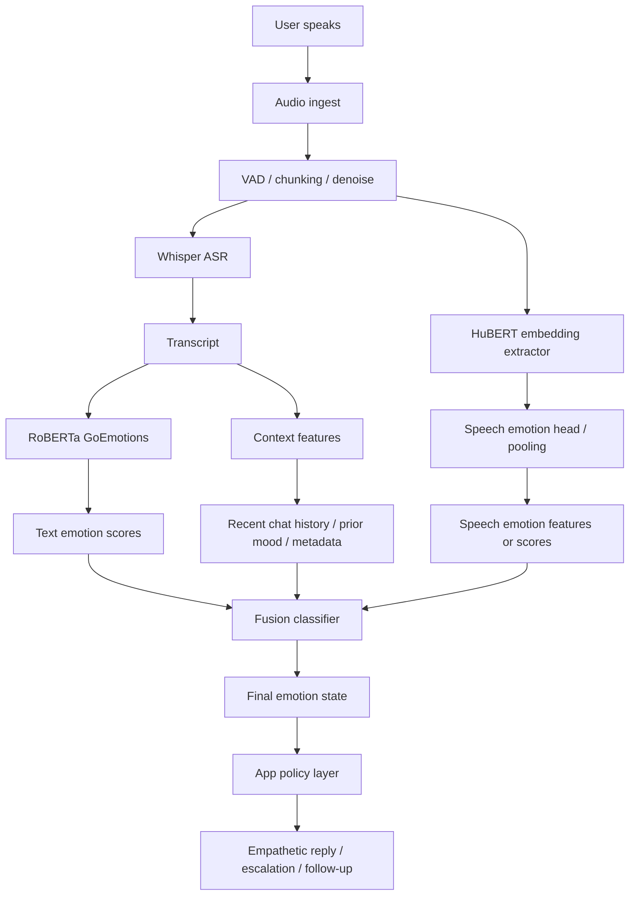
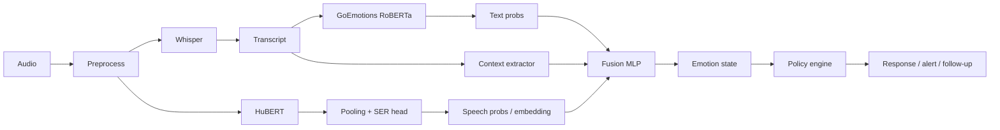
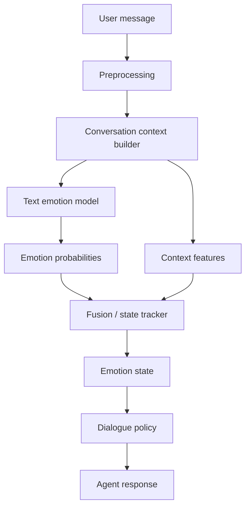

A good rough flow is:



The intuition is simple: **Whisper tells you what was said**, **HuBERT tells you how it was said**, **RoBERTa GoEmotions estimates emotion from the transcript**, and a small fusion model combines those signals into one final state. Whisper is built for multilingual speech recognition and language identification, while HuBERT is a self-supervised speech representation model designed to learn useful acoustic features from raw audio. ([GitHub][1])

A practical step-by-step pipeline looks like this:

**1. Audio ingest and preprocessing**
You receive an audio clip or stream, normalize sample rate, run basic denoising if needed, and split the audio into utterance-sized chunks with voice activity detection. This matters because emotion signals degrade when you feed long, silence-heavy, or noisy segments into downstream models. That is especially true for speech emotion work, where pooling over irrelevant frames can hurt performance. ([arXiv][2])

**2. Run two branches in parallel**
From the same cleaned audio chunk, you launch:

* an **ASR branch** with Whisper
* an **acoustic branch** with HuBERT embeddings

Whisper gives you the transcript and optionally language information. HuBERT gives you frame-level or pooled speech representations that capture prosody and other acoustic cues useful for downstream tasks. ([GitHub][1])

**3. Text emotion branch**
Take the Whisper transcript and feed it into your text emotion classifier. A GoEmotions-style RoBERTa model is useful here because GoEmotions was designed for fine-grained emotion labeling with many categories rather than just positive/negative sentiment. Hugging Face model cards built on GoEmotions typically expose multi-label emotion outputs over 27 emotions plus neutral. ([Hugging Face][3])

Example output:

```json
{
  "sadness": 0.41,
  "fear": 0.12,
  "neutral": 0.22,
  "gratitude": 0.05
}
```

**4. Speech emotion branch**
For HuBERT, you usually do not use the raw embedding directly as the final answer. Instead, you add a small downstream head: temporal pooling plus a classifier or regressor. That head converts frame-level HuBERT representations into emotion logits, valence-arousal scores, or a compact embedding. A lot of SER systems follow this “SSL upstream + lightweight downstream head” pattern. ([arXiv][2])

Example output:

```json
{
  "speech_embedding": [ ... ],
  "arousal": 0.78,
  "valence": 0.24,
  "anger": 0.18,
  "sadness": 0.49
}
```

**5. Add context features before fusion**
This is the part many systems skip. Do not fuse only current-turn text and speech. Also add lightweight context such as:

* previous 3–5 emotion states
* whether sentiment is worsening
* message length / speech duration
* pauses, hesitations, speaking rate
* whether the user is discussing medication, symptoms, adherence, or distress keywords

The reason is that emotion in real products is often a **state over time**, not a single-turn label. This is especially relevant for your health companion direction, where “frustrated for 4 turns” is much more useful than “anger = 0.31 on this one utterance.” This is an inference from the architecture pattern above rather than a direct claim from one source. ([GitHub][1])

**6. Fusion classifier**
Now concatenate the features:

* text emotion probabilities
* HuBERT speech features or speech emotion probabilities
* context features

Then feed them into a small model such as:

* logistic regression
* MLP with 1–2 hidden layers
* XGBoost / LightGBM
* simple gated fusion network

For a first version, an MLP is enough. The fusion model predicts one of:

* categorical emotion
* valence/arousal
* product-specific states like `calm`, `distressed`, `frustrated`, `confused`, `engaged`

This “small fusion head on top of strong encoders” is usually the right engineering tradeoff. HuBERT provides strong upstream speech features, and Whisper plus RoBERTa handles linguistic content. ([GitHub][1])

A concrete feature interface could be:

```python
fusion_input = {
    "text_probs": [p_anger, p_sadness, p_fear, ...],
    "speech_probs": [p_anger_s, p_sadness_s, p_neutral_s, ...],
    "speech_embed": hubert_pooled_vector,
    "asr_confidence": whisper_conf,
    "context": [prev_distress, trend_3turn, duration_sec, speaking_rate]
}
```

**7. Output layer for product use**
Do not expose raw model labels directly to the app. Map them into product-safe states, for example:

* `stable`
* `needs_reassurance`
* `confused`
* `distressed`
* `urgent_review`

Then your policy layer decides what to do:

* soften tone
* ask a follow-up question
* summarize calmly
* escalate to clinician / caregiver workflow if appropriate

That final mapping is product logic, not model logic. In a healthcare-style assistant, this separation is important because model labels and intervention policy should not be tightly coupled.

A clean production version is:



For your use case, I would implement it in **two phases**:

**Phase 1: simple but strong**

* Whisper transcript
* RoBERTa GoEmotions on transcript
* HuBERT pooled embedding
* small MLP fusion
* output 5 product states

**Phase 2: more robust**

* add turn history
* add valence/arousal regression
* add confidence calibration
* add abstain / “uncertain” option
* add safety rules for distress escalation

That path is usually better than trying to build a giant end-to-end multimodal model immediately.

One important design tip: **keep both the intermediate outputs and the final fused output**. In debugging, it is extremely useful to see:

* transcript
* text emotion scores
* speech emotion scores
* final fused label
* confidence
* explanation features

That makes it much easier to understand failures like:

* transcript says “I’m okay”
* voice sounds shaky
* fusion decides `distressed`

If you want, I can turn this into a more implementation-ready version with:

1. exact JSON contracts between modules, and
2. a Python/FastAPI-style pipeline skeleton.

[1]: https://github.com/openai/whisper?utm_source=chatgpt.com "openai/whisper: Robust Speech Recognition via Large- ..."
[2]: https://arxiv.org/pdf/2202.03896?utm_source=chatgpt.com "speech emotion recognition using self-supervised features"
[3]: https://huggingface.co/kashyaparun/Mental-Health-Chatbot-using-RoBERTa-fine-tuned-on-GoEmotion?utm_source=chatgpt.com "Mental-Health-Chatbot-using-RoBERTa-fine-tuned-on- ..."

For **text-only emotion detection during a user ↔ chat agent conversation**, the architecture is simpler but you should still design it carefully. The key idea is: **emotion is contextual and temporal**, not just per-message classification.

I'll explain the **best practical flow** and the **models that work well**.

---

# 1. High-Level Text Emotion Pipeline



The core components are:

1️⃣ **Emotion classifier**
2️⃣ **Conversation context tracker**
3️⃣ **Emotion state estimator**

---

# 2. Step-by-Step Flow

## Step 1 — User sends a message

Example:

```
User: I’ve been trying to follow the diet plan but it’s really hard.
```

---

## Step 2 — Preprocess the text

Basic operations:

```python
text = normalize_unicode(text)
text = strip_urls(text)
text = lowercase(text)
```

Optional features:

* message length
* punctuation intensity
* exclamation marks
* emoji detection

Example feature vector:

```json
{
 "num_words": 14,
 "exclamation": 0,
 "question": 0,
 "emoji": false
}
```

---

# 3. Run Emotion Model

Recommended model:

* roberta-large-go-emotions

It outputs probabilities for **27 emotions**.

Example:

```json
{
 "sadness": 0.42,
 "disappointment": 0.27,
 "neutral": 0.18,
 "anger": 0.07
}
```

---

# 4. Use Conversation Context

Single-message emotion detection is **often wrong**.

Example:

```
User: fine
```

Without context → neutral
With context → frustration

So include **conversation memory**.

Example context input:

```json
{
 "last_emotion": "sadness",
 "emotion_trend": "increasing",
 "turn_index": 6,
 "recent_negative_messages": 3
}
```

---

# 5. Emotion State Tracker

Instead of using raw predictions directly, maintain a **running emotional state**.

Example:

```
turn 1 → neutral
turn 2 → disappointment
turn 3 → sadness
```

State tracker:

```python
emotion_state = alpha * current_prediction + (1-alpha) * previous_state
```

Example output:

```json
{
 "dominant_emotion": "frustration",
 "confidence": 0.71,
 "trend": "worsening"
}
```

---

# 6. Map Emotion → System Behavior

Your system should not react directly to raw emotions.

Instead map them to **interaction states**.

Example mapping:

| Emotion     | Agent behavior      |
| ----------- | ------------------- |
| frustration | empathetic response |
| sadness     | reassurance         |
| confusion   | clarification       |
| anger       | de-escalation       |
| neutral     | normal response     |

Example:

User:

```
I'm really frustrated with this meal plan.
```

Agent response policy:

```
I understand it can feel frustrating when changes are difficult.
Let’s try adjusting the plan to make it easier.
```

---

# 7. Recommended Models for Text Emotion

### Best lightweight model

roberta-large-go-emotions

Pros:

* strong performance
* fine-grained emotion labels
* easy to run locally

---

### Best high-accuracy option

DeBERTa-v3-large

Fine-tuned on GoEmotions.

Pros:

* better contextual understanding
* stronger on subtle emotions

Cons:

* heavier model

---

### LLM-based approach

You can also do structured prompting using:

* GPT-4o
* Llama 3

Example prompt:

```
Classify the user's emotional state.

Return JSON:
{
 emotion: "",
 intensity: 0-1,
 explanation: ""
}
```

LLMs handle **sarcasm and context better**, but they are slower.

---

# 8. Best Practical Architecture

For a production conversational system:

```
User message
     │
     ▼
Context builder
(last 5 messages)
     │
     ▼
RoBERTa GoEmotions
     │
     ▼
Emotion probabilities
     │
     ▼
Emotion state tracker
     │
     ▼
Conversation policy
     │
     ▼
Agent response
```

---

# 9. Typical Emotion Categories Used in Chat Systems

Instead of 27 labels, many systems collapse them into **5–8 operational states**:

| Category   | Derived emotions        |
| ---------- | ----------------------- |
| positive   | joy, gratitude          |
| neutral    | neutral                 |
| confused   | confusion, curiosity    |
| frustrated | annoyance, anger        |
| sad        | sadness, disappointment |
| distressed | fear, despair           |

This simplifies policy design.

---

# 10. What Most Systems Get Wrong

The biggest mistake is:

```
emotion = model(message)
```

Instead use:

```
emotion = f(message, conversation_history)
```

Emotion in dialogue is **stateful**.

---

✅ **Practical recommendation**

For your conversational agent:

```
Model:
roberta-large-go-emotions

Context window:
last 5 messages

State tracker:
EMA smoothing

Output:
6 operational emotions
```

This is **simple, stable, and production-ready**.

---

If you want, I can also show you **how companies like Character AI and Replika structure emotion-aware dialogue systems**, which is **very different from simple emotion classification** and much more effective.

