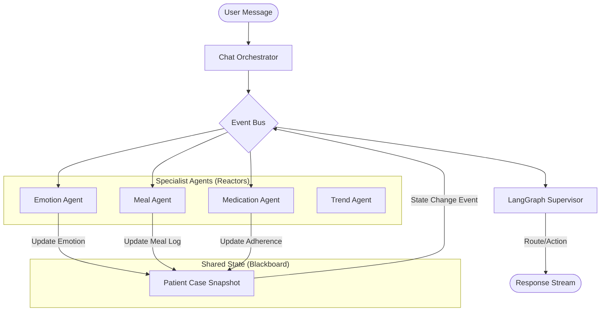

# CarePilot Event-Driven Choreography Architecture

## Overview
Transition from a deterministic orchestrator-led flow to a reactive "Blackboard" architecture.

## Key Components

### 1. The Blackboard (PatientCaseSnapshot)
- Centralized source of truth for the current interaction.
- Contains: Demographics, Clinical Profile, Recent Activities, Active Intent, and Emotional State.
- Every state change triggers a "Blackboard Updated" event.

### 2. Reactor Agents
- Instead of being *called* by the supervisor, agents *observe* the Blackboard.
- Each agent has an "Interest Filter" (e.g., MealAgent is interested in "food" intent or "meal" logs).
- Agents propose "State Mutations" rather than making direct DB writes.

### 3. Safety Supervisor
- A high-level LangGraph node that monitors the Blackboard for safety risks or contradictory proposals.
- Responsible for the final synthesis and response generation.

## Implementation Steps
1. Define a `DomainEvent` contract.
2. Implement a local `InProcessEventBus`.
3. Refactor `ChatOrchestrator` to emit `UserMessageReceived` events.
4. Promote `EmotionAgent` to a standalone Reactor.
