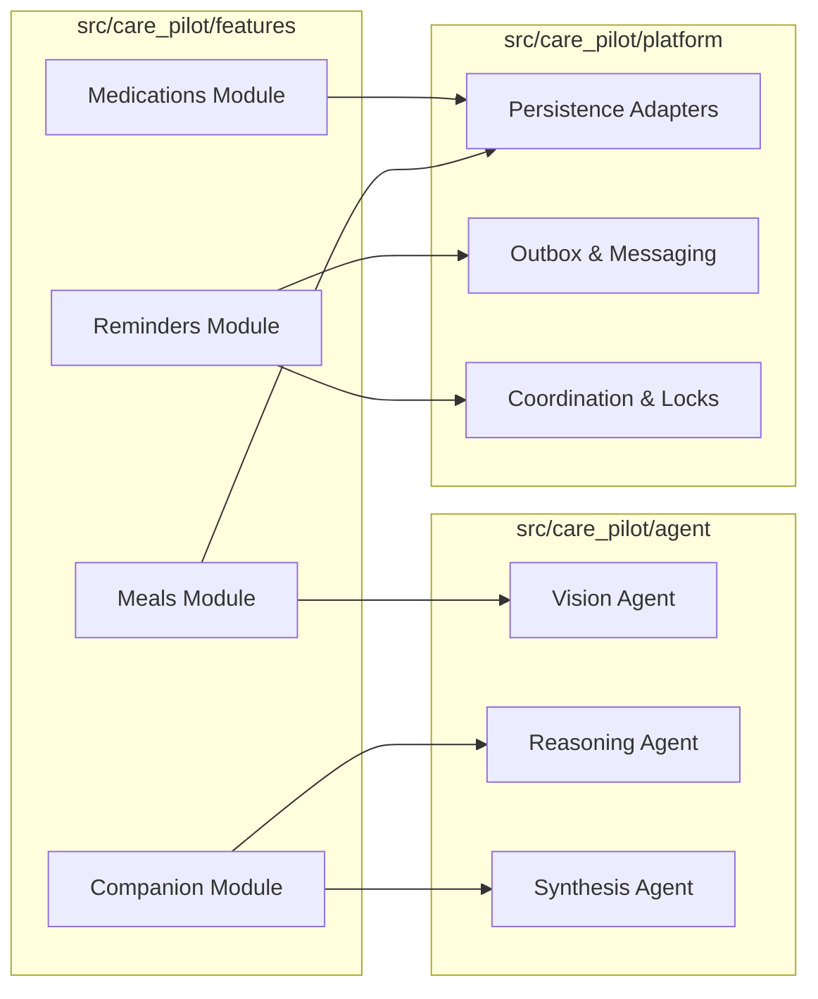

# AI Health Companion — System Architecture

## 1. System Overview
CarePilot is a multimodal, AI-powered health companion platform built using a **feature-first modular monolith** pattern. The system is designed to provide proactive, personalized guidance to patients managing chronic diseases in the Singaporean context.

## 2. Architecture Layers

*   **Client Layer (Next.js 14):** Modern React-based frontend providing an interactive dashboard, real-time chat, and multimodal upload capabilities.
*   **API Layer (FastAPI):** High-performance Python API owning session management, policy enforcement, and event-driven workflow routing. Legacy orchestration-first paths are archived.
*   **Application Layer (Workflows):** Complex, explicit journeys coordinated using **LangGraph** within the event-driven model.
*   **Services Layer (Use Cases):** Feature-specific application services that implement business entrypoints.
*   **Agent Layer (Inference):** Bounded, model-backed agents implemented with `pydantic-ai` for perception, reasoning, and synthesis.
*   **Projection Layer:** Deterministic projectors that materialize `PatientCaseSnapshot` sections from events.
*   **Reaction Layer:** Async enrichments and side effects triggered by domain events.
*   **Data Layer (Storage):** SQLite for durable state and audit logs; Redis for ephemeral coordination and worker signaling.
*   **Infrastructure Layer:** Background workers consuming tasks from the scheduler and outbox.

## 3. High-Level Architecture Diagram (Mermaid)

```mermaid
flowchart TD
    User([User]) <--> Web[Next.js Frontend]
    Web <--> API[FastAPI Gateway]
    
    API --> Auth[Auth & Policy]
    API --> Workflow[LangGraph Workflows]
    
    Workflow --> MealFlow[Meal Analysis Workflow]
    Workflow --> MedFlow[Medication Ingest Workflow]
    
    MealFlow --> MealAgent[Meal Perception Agent]
    MedFlow --> MedAgent[Prescription Extract Agent]
    
    API --> CompService[Companion Workflow Coordinator (legacy name)]
    CompService --> Snapshot[Case Snapshot Service]
    CompService --> Engage[Engagement Engine]
    CompService --> Emotion[Emotion Inference Agent]
    
    API --> Remind[Reminder Service]
    Remind --> Scheduler[Scheduler]
    Scheduler --> Worker[Background Worker]
    Worker --> Notif[Notification Dispatch]

    Workflow --> Timeline[Event Timeline]
    Timeline --> Projectors[Snapshot Projectors]
    Projectors --> Snapshot
    Timeline --> Reactions[Async Reactions]
    Reactions --> Worker
    
    Snapshot --> DB[(SQLite DB)]
    Workflow --> DB
    Remind --> DB
    Timeline --> DB
```

## 4. Component Architecture Diagram (Mermaid)



## 5. Data Flow Diagram

1.  **Input:** User uploads a meal image + message.
2.  **Perception:** `MealPerceptionAgent` (Vision LLM) extracts dish names and portion estimates.
3.  **Normalization:** `MealService` maps perceived dishes to the canonical hawker food database.
4.  **Enrichment:** `CompanionOrchestrator` (legacy name) loads the patient's `CaseSnapshot` (current medications, biomarkers) as part of the event-driven flow.
5.  **Reasoning:** `DietaryAgent` (LLM) evaluates the meal's impact given the patient's health profile.
6.  **Persistence:** The validated event is saved to the `Event Timeline`.
7.  **Projection:** Projectors update the materialized snapshot sections.
8.  **Reactions:** Optional async reactions enrich or notify without mutating core state.
7.  **Output:** The user receives immediate Singlish feedback and updated dashboard metrics.

## 6. Message Channels (Inbound/Outbound)

Message channels are the canonical interface for reminders and chat‑style interactions. Inbound channel payloads are normalized into message threads, persisted in `message_thread_messages`, then processed by event-driven workflows (legacy orchestration components remain only for exploration context). Outbound responses are enqueued via the outbox and delivered through channel adapters with optional media attachments.

## 7. Draw.io Diagram Instructions

To recreate the system architecture in Draw.io:
1.  **Layout:** Use a layered (top-to-bottom) approach.
2.  **Top Layer:** "User" (Actor) and "Web Application" (Container).
3.  **Middle Layer:** "API Gateway" (Box), connected to sub-boxes for "Workflows" and "Feature Services".
4.  **Internal Flow:** "Workflows" should point to "Inference Agents" (Rhombus shape) and "Domain Repositories".
5.  **Bottom Layer:** "Durable Storage" (Cylinder), "Message Queue/Outbox", and "Background Workers".
6.  **Color Coding:** Use **Teal** for features, **Amber** for AI/Agents, and **Slate** for Infrastructure.

## 8. Key Architectural Design Decisions

*   **Feature-First Modular Monolith:** We chose this over microservices to minimize latency and operational complexity while maintaining clear domain boundaries.
*   **Bounded Agents:** Agents never write to the database. They return structured proposals that are validated by deterministic domain logic.
*   **Event Timeline as Source of Truth:** All significant state changes are recorded as events, allowing for easy longitudinal tracking and AI replay.
*   **Replay Safety:** Materialized snapshots are rebuildable from the event timeline, and projections are deterministic to ensure auditability and safe reprocessing.
*   **Local-First Default:** The system targets SQLite by default, making it easy to deploy in resource-constrained or edge environments common in clinical settings.
