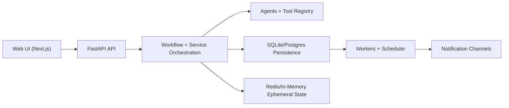

# System Overview

Last updated: 2026-03-06  
Source of truth for architecture detail: [`ARCHITECTURE.md`](/Users/zhoufuwang/Projects/dietary_tools/ARCHITECTURE.md)

## Purpose
Dietary Guardian SG is a health support platform for:
- people managing chronic conditions, and
- general wellness users tracking nutrition, symptoms, and medication adherence.

The system combines meal analysis, reminder automation, recommendation generation, safety guardrails, and workflow observability in a single platform with a FastAPI backend and Next.js frontend.

## High-Level Architecture
The architecture is layered:
- Interface layer: Next.js app (`apps/web`) and supporting client-side flows
- API layer: FastAPI transport and policy enforcement (`apps/api/dietary_api`)
- Orchestration layer: workflow coordination, timeline capture, and service composition (`src/dietary_guardian/services`)
- Agent/tool layer: agents, tool registry, and policy evaluation (`src/dietary_guardian/agents`, `src/dietary_guardian/services/tool_registry.py`)
- Data layer: durable persistence and ephemeral state (`src/dietary_guardian/infrastructure`)
- Worker/runtime layer: reminder scheduler and async execution (`apps/workers`, scheduler services)

## Key Subsystems and Responsibilities

### Authentication and Access Control
- Session-based auth and RBAC scope checks.
- Centralized policy enforcement in API routes.
- Core references: `apps/api/dietary_api/policy.py`, `docs/rbac-matrix.md`.

### Meal and Nutrition Intelligence
- Meal ingestion and nutrition summaries (daily/weekly).
- Pattern detection for nutrition imbalance signals.
- Core references: meals routers/services and nutrition services.

### Recommendation and Suggestion System
- Adaptive recommendation generation and substitution ranking.
- Interaction feedback loop persisted for future recommendations.
- Core references: recommendation contracts and services.

### Medication and Reminder Automation
- Medication regimen CRUD, adherence tracking, reminder schedule generation.
- Multi-channel notification dispatch through scheduler/outbox.
- Core references: medication/reminder routers, scheduler services, workers.

### Symptoms, Reports, and Clinical Cards
- Symptom check-ins with summaries.
- Report parsing with symptom context.
- Clinical card generation for clinician-ready snapshots.
- Core references: symptoms/reports/clinical-cards routers/services.

### Workflow Governance and Observability
- Workflow list/replay timeline inspection.
- Runtime contract snapshot and tool policy governance endpoints.
- Correlation IDs and request IDs for traceability.
- Core references: workflows router/service and `/workflows` UI.

## Runtime Modes
- Default local mode: SQLite + optional in-memory ephemeral services.
- Target-aligned local mode: Postgres + Redis with external worker.
- Runtime toggles and readiness checks are documented in [`docs/config-reference.md`](/Users/zhoufuwang/Projects/dietary_tools/docs/config-reference.md).

## When to Update This Document
- Add/remove major subsystems.
- Changes to architecture layers or ownership boundaries.
- Significant runtime model changes (e.g., default backend shifts).
