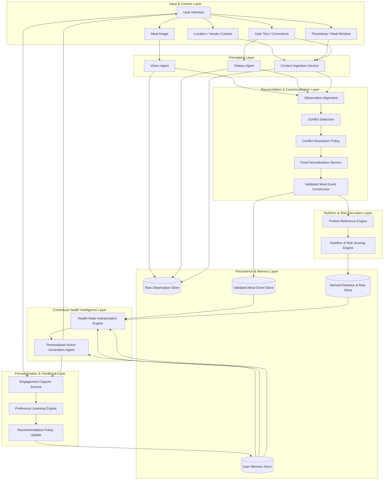
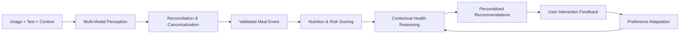

# AI Dietary Companion: Robust Closed-Loop Multi-Modal Architecture

> **Status**: Implemented in the feature-first architecture (March 12, 2026).  
> **Note**: This document is retained as the design rationale; refer to `docs/meal-analysis-agents.md` and `ARCHITECTURE.md` for current module paths.

## 1. Executive Framing

This system should be described as a:

**Closed-Loop Multi-Modal Dietary Intelligence System**

Its purpose is not just to detect food, but to:

* perceive meals from multiple signals
* reconcile uncertainty before storage
* reason over long-term health context
* generate actionable personalized guidance
* adapt future recommendations from user behavior

This is what makes it stronger than:

* a calorie tracker
* a food recognition model
* a generic chatbot

Formally, the system operates as:

**Perception → Reconciliation → Canonicalization → Health Reasoning → Personalized Action → Preference Adaptation**

---

# 2. Core Design Principles

Before the stages, these are the principles that should guide the architecture.

## Principle A: Agents handle ambiguity, deterministic services handle truth

Use agents where interpretation is fuzzy:

* image understanding
* language understanding
* explanation
* personalization
* behavioral coaching

Use deterministic services where consistency matters:

* schema validation
* canonical food mapping
* nutrition lookup
* health scoring
* storage
* trend computation

## Principle B: Never collapse raw observations directly into final truth

Store multiple layers:

* raw observations
* reconciled meal event
* derived health summary
* user engagement outcome

This keeps the system auditable and improvable.

## Principle C: Personalize recommendations, not nutrition truth

The system should learn:

* what foods the user prefers
* what type of nudges work
* when to intervene
* what alternatives are likely accepted

The system should **not** distort:

* nutrition estimates
* health thresholds
* clinical risk logic

## Principle D: Preserve uncertainty

Do not force false certainty.
A strong system should explicitly represent:

* candidate foods
* confidence
* ambiguity
* unresolved conflicts
* image quality limitations

This increases trustworthiness.

---

# 3. Full Architecture Overview

The architecture has **six layers**:

1. **Input & Context Layer**
2. **Perception Layer**
3. **Reconciliation & Canonicalization Layer**
4. **Persistence & Memory Layer**
5. **Contextual Health Intelligence Layer**
6. **Personalization & Feedback Layer**

---

# 4. End-to-End Flow Summary

## High-level flow

```text
User Input (Image + Text + Context)
→ Multi-Modal Extraction
→ Reconciliation & Conflict Resolution
→ Canonical Meal Event Construction
→ Nutrition / Risk Scoring
→ Contextual Health Reasoning
→ Personalized Recommendations
→ User Interaction Feedback
→ Preference Adaptation
→ Better next recommendation cycle
```

---

# 5. Stage-by-Stage System Plan

---

## Stage 1: Multi-Modal Ingestion

This is the **Perception Phase**.

Its purpose is to gather all signals that may help interpret a meal.

### Inputs

* meal image
* optional user text
* timestamp
* location / vendor context
* optional profile context
* optional meal type hint from UI

### Components

* **Vision Agent**
* **Dietary Agent**
* **Context Ingestion Service**

---

## Stage 1A: Vision Agent

### Role

The Vision Agent interprets image data and produces **bounded structured observations** only.

It should not produce final medical advice.

### Responsibilities

The Vision Agent should output:

* food candidates
* food component count
* likely preparation style
* visible ingredients/components
* portion cues
* packaging / branding cues
* drink detection
* meal type hints
* image quality flags
* confidence scores
* ambiguity notes

### Example outputs

* “white rice”
* “fried chicken”
* “packaged sweetened drink”
* “teh tarik-like beverage”
* “portion appears medium”
* “food partially occluded”
* “confidence 0.71”

### Recommended output fields

* `detected_items`
* `candidate_label`
* `candidate_aliases`
* `preparation_style`
* `visible_attributes`
* `portion_estimate`
* `confidence`
* `image_quality`
* `occlusion_flags`
* `packaging_brand_cues`
* `uncertainty_notes`

### Important constraint

The Vision Agent should return **strict bounded JSON**, not freeform conversational text.

---

## Stage 1B: Dietary Agent

### Role

The Dietary Agent processes natural language and transforms it into structured semantic claims.

It is not just a chatbot. It is a **semantic claim extractor**.

### Responsibilities

The Dietary Agent should output:

* user-stated food identity
* quantity corrections
* consumption fraction
* meal timing
* user-reported modifications
* meal context
* dietary intention
* user certainty level
* known vendor / source clues
* explicit restrictions or concerns

### Example semantic claims

* “I only ate half”
* “This is iced Milo”
* “Breakfast after gym”
* “Bought from Toast Box”
* “No sugar”
* “I skipped the rice”
* “This is dinner”
* “I shared it”

### Recommended output fields

* `user_claimed_food_items`
* `consumption_fraction`
* `quantity_adjustments`
* `meal_time_label`
* `vendor_or_source`
* `preparation_override`
* `dietary_constraints_mentioned`
* `user_goal_context`
* `certainty_level`
* `language_ambiguity_notes`

### Key insight

This agent should produce **claims**, not final truth.

---

## Stage 1C: Context Ingestion Service

### Role

Collect structured environmental and session metadata that helps later disambiguation.

### Inputs

* timestamp
* geolocation
* nearby vendors
* meal history proximity
* user profile basics
* known cuisine priors

### Outputs

* `timestamp`
* `meal_window`
* `location_cluster`
* `vendor_candidates`
* `regional_food_prior`
* `user_context_snapshot`

### Example value

If the user is at a hawker centre with known drink stalls, that becomes a useful prior for disambiguating “brown beverage.”

---

# Stage 2: Reconciliation and Canonicalization

This is the **Semantic Synthesis Phase**.

This stage should be one of the strongest parts of the architecture.

Its purpose is to transform multiple uncertain observations into a **structured, auditable meal event**.

This stage should be **mostly deterministic with bounded arbitration**, not purely open-ended agent reasoning.

### Main component

* **Meal Fusion Engine**
  or
* **Consolidator / Reconciliation Engine**

I recommend using the name:

**Meal Reconciliation & Canonicalization Engine**

because it sounds robust and formal.

---

## Stage 2A: Observation Alignment

### Role

Align outputs from:

* Vision Agent
* Dietary Agent
* Context Ingestion Service

### Responsibilities

* entity matching
* temporal alignment
* meal boundary resolution
* duplicate candidate merging
* claim-source linkage

### Example

Vision sees:

* “milk tea”

Dietary text says:

* “iced Milo”

Context says:

* kopitiam beverage stall

System aligns these as competing hypotheses for the same drink entity.

---

## Stage 2B: Conflict Detection

### Role

Detect disagreements between modalities.

### Types of conflicts

* food identity conflict
* portion conflict
* preparation conflict
* meal type conflict
* vendor conflict
* quantity conflict

### Example

* vision: “fried noodles”
* text: “mee goreng”
* location: Indian-Muslim stall

This is not a hard conflict; it may be resolvable by canonical mapping.

Another example:

* vision: “full bowl”
* text: “I only ate half”

This is a consumption conflict, resolved by giving user claim priority for consumed amount.

---

## Stage 2C: Conflict Resolution Policy

This is critical for robustness.

You should define explicit priority logic.

### Recommended resolution rules

1. **User-stated consumption amount overrides image-based consumption assumptions**
2. **User-stated food identity can override visual ambiguity when plausible**
3. **Vision dominates when user text is absent or extremely vague**
4. **Context acts as a prior, not absolute truth**
5. **Uncertainty should be preserved if conflict is unresolved**
6. **Canonical mapping happens after reconciliation, not before**

### Example policy

* If user says “I only drank half,” then consumption fraction = 0.5
* If image shows generic sweet drink but user says “iced Milo,” accept user claim if consistent
* If image is very poor and text says “chicken rice,” trust text more strongly
* If image strongly indicates fried chicken but text says “fish,” mark ambiguity and retain alternatives

---

## Stage 2D: Canonical Food Mapping

### Role

Map reconciled food mentions to canonical food entities in your food database.

### Responsibilities

* alias normalization
* food ID assignment
* cuisine-aware disambiguation
* preparation-style resolution
* beverage normalization
* packaged-item linking when available

### Example mappings

* “fried noodles” → canonical candidate set
* “mee goreng” → canonical food ID
* “Ice Milo” → beverage food ID
* “teh peng” → local beverage canonical ID
* “crispy chicken” → fried chicken canonical entry

### Techniques

* alias tables
* fuzzy string matching
* context-aware heuristics
* optional embedding-based fallback later

---

## Stage 2E: Validated Meal Event Construction

### Role

Construct the final structured meal event for storage.

This object should not lose provenance.

### A strong meal event should include:

* meal event ID
* timestamp
* meal type
* primary food items
* alternative hypotheses
* portion estimates
* consumption fraction
* source provenance
* confidence summary
* unresolved ambiguities
* linked vendor/location context
* canonical food IDs

### This becomes the system’s core transaction object

---

# Stage 3: Nutrition & Risk Derivation

This is the **Deterministic Health Scoring Phase**.

This stage should not be handled by a freeform LLM.

It should be deterministic and reproducible.

### Main component

* **Nutrition & Risk Scoring Engine**

### Inputs

* validated meal event
* canonical food database
* portion reference database
* user-specific rule set if needed

### Outputs

* estimated calories
* protein/carbs/fat
* sugar estimate
* sodium estimate
* fiber estimate
* meal balance score
* chronic-care risk tags
* uncertainty bounds

### Responsibilities

* convert portions into approximate grams
* aggregate nutrition across meal items
* compute meal-level risk tags
* estimate nutritional burden conservatively
* produce scoreable features for later reasoning

### Example risk tags

* `high_sodium`
* `high_added_sugar`
* `fried`
* `refined_carb_heavy`
* `low_fiber`
* `protein_rich`
* `balanced`
* `ultra_processed`

### Important note

This stage should also output **uncertainty-aware nutrition** if meal ambiguity remains.

For example:

* sodium estimate range
* confidence-adjusted calories
* likely risk class rather than exact false precision

---

# Stage 4: Persistence & Memory Layer

This is the **Structured Memory Phase**.

You should not store only one flat “meal log” table.

Store multiple layers.

---

## Stage 4A: Raw Observation Store

### Purpose

Save what each source originally detected.

### Store

* vision observations
* language-derived claims
* context metadata
* raw confidence values
* image quality notes

### Why

This supports:

* auditability
* debugging
* model improvement
* future retraining
* explainability

---

## Stage 4B: Reconciled Meal Event Store

### Purpose

Store the validated meal interpretation.

### Store

* canonical items
* portions
* consumption fractions
* vendor/location context
* confidence summary
* alternative candidates
* resolution notes

This is the main meal record.

---

## Stage 4C: Derived Nutrition & Risk Store

### Purpose

Store deterministic computed health metrics.

### Store

* calories
* macros
* sodium
* sugar
* meal score
* risk tags
* uncertainty bounds
* health-rule outputs

---

## Stage 4D: User Memory Store

### Purpose

Store long-term user state.

### Store

* health profile
* chronic conditions
* goals
* restrictions
* cuisine preferences
* vendor preferences
* recommendation interaction history
* coaching style preferences
* adherence patterns

---

# Stage 5: Contextual Health Intelligence

This is the **Reasoning Phase**.

This layer uses the new meal and combines it with long-term memory to interpret what the meal means for this specific user.

This stage should be split into two parts:

1. **Health-State Interpretation**
2. **Personalized Action Generation**

That makes the architecture stronger.

---

## Stage 5A: Health-State Interpretation Engine

### Role

Interpret the significance of the meal in the context of the user’s broader dietary state.

### Inputs

* validated meal event
* derived nutrition/risk record
* user profile
* goals
* historical logs
* recent meal sequence
* condition constraints
* preference memory

### Responsibilities

* compare meal against daily goals
* detect risk accumulation
* detect trend patterns
* estimate goal alignment
* identify repeated unhealthy patterns
* identify positive improvement patterns
* surface meal significance

### Example outputs

* “Lunch is sodium-heavy relative to recent trend”
* “Sugar load is high given recent beverage pattern”
* “Meal is protein-adequate but low in fiber”
* “This dinner choice improves over user’s usual pattern”

### Key point

This is interpretation, not yet recommendation wording.

---

## Stage 5B: Personalized Action Generation Agent

### Role

Transform interpreted health state into actionable, human-friendly interventions.

### This is where agentic reasoning is useful.

### Outputs should include four major categories

* **Alternative Suggestions**
* **Practical Tips**
* **Long-Term Impact Analysis**
* **Behavioral Encouragement**

### Responsibilities

* suggest healthier substitutes
* propose next-meal balancing actions
* provide practical modifications
* explain why the current meal matters
* generate encouraging, non-judgmental feedback
* tailor tone to user preference

### Example outputs

* “For dinner, choose soup-less or grilled protein to balance sodium”
* “Reducing sweet drinks this evening would help offset today’s sugar intake”
* “You’re improving consistency compared to last week’s lunch pattern”
* “If you want similar taste, try unsweetened Milo or a smaller serving next time”

### Important constraint

This agent should not invent nutrition facts.
It should ground its recommendations on deterministic outputs from the previous stages.

---

# Stage 6: Personalization & Feedback Adaptation

This is the **Optimization Loop**.

I would not present this as “the model retrains itself online.”
I would present it as:

**Preference Adaptation and Intervention Optimization**

That sounds safer and more accurate.

---

## Stage 6A: Engagement Capture Service

### Role

Collect how the user responds to recommendations.

### Signals

* accepted recommendation
* ignored recommendation
* clicked alternative
* edited meal log
* corrected system prediction
* repeated same food choice later
* timing of response
* tone preference indicators

### Example

If the user ignores “avoid sweet drinks” but often accepts “choose smaller portion,” that becomes useful behavioral information.

---

## Stage 6B: Preference Learning Engine

### Role

Update soft user preferences and intervention policy.

### What it should learn

* preferred cuisines
* preferred substitutes
* likely meal times
* vendor habits
* receptiveness to certain nudges
* preferred explanation style
* preferred feedback tone
* difficulty areas

### What it should not directly modify

* core nutrition values
* health risk thresholds
* disease logic
* canonical food truth

This distinction is very important.

---

## Stage 6C: Recommendation Policy Update

### Role

Improve ranking and delivery of future recommendations.

### It should adapt:

* recommendation ranking
* timing of nudges
* wording style
* suggestion category ordering
* alternative meal strategy
* intervention frequency

### Example

The system may learn:

* user prefers local food swaps over abstract advice
* user responds better to encouragement than warnings
* user accepts beverage changes more than meal elimination
* user is more receptive during lunch than late-night reminders

This is what makes the system truly feel intelligent over time.

---

# 6. Strong Data Objects You Should Use

To make the architecture robust, define explicit objects.

## Object 1: RawObservationBundle

Contains:

* image observations
* dietary claims
* contextual metadata
* confidence
* quality flags

## Object 2: ValidatedMealEvent

Contains:

* canonical meal items
* portions
* consumption fractions
* confidence summary
* alternatives
* provenance
* meal metadata

## Object 3: NutritionRiskProfile

Contains:

* calories
* macros
* sugar/sodium
* risk tags
* meal balance score
* uncertainty bands

## Object 4: HealthInterpretation

Contains:

* goal alignment
* short-term implication
* long-term pattern relevance
* repeated risks
* positive signals

## Object 5: RecommendationPackage

Contains:

* alternatives
* practical tips
* behavior encouragement
* long-term implication
* ranked interventions

## Object 6: EngagementRecord

Contains:

* recommendation shown
* user action
* accepted/ignored
* timing
* context
* policy learning features

---

# 7. Recommended Agent / Service Breakdown

Here is the cleanest split.

## Agents

Use LLM / foundation model style reasoning for:

* Vision Agent
* Dietary Agent
* Personalized Action Generation Agent

## Deterministic Services

Use conventional backend logic for:

* Context Ingestion Service
* Meal Reconciliation & Canonicalization Engine
* Food Normalization Service
* Nutrition & Risk Scoring Engine
* Trend Analysis Service
* Engagement Capture Service
* Preference Learning Engine

## Hybrid / bounded reasoning components

Can be rule-heavy with optional model assistance:

* conflict arbitration
* meal significance interpretation
* recommendation ranking

---

# 8. Recommended Mermaid Diagram

Here is a strong version you can later redraw in draw.io.



---

# 9. Simpler Mermaid for Executive Slide

If you want a cleaner top-level version:



---

# 10. Suggested Text for Each Box in draw.io

These are nice short labels for your professional diagram.

## Input & Context Layer

**Collects meal image, user corrections, meal timing, and environmental context**

## Vision Agent

**Extracts food candidates, portion cues, packaging clues, and image quality metadata**

## Dietary Agent

**Transforms user language into structured claims about identity, quantity, and meal context**

## Context Ingestion Service

**Adds vendor, location, and temporal priors to improve interpretation**

## Reconciliation & Canonicalization Layer

**Aligns multi-modal evidence, resolves conflicts, maps foods to canonical entities, and constructs auditable meal events**

## Nutrition & Risk Scoring Engine

**Computes reproducible nutrition estimates, risk tags, and meal-level health signals**

## Persistence & Memory Layer

**Stores raw observations, validated meal events, derived health summaries, and long-term user preferences**

## Health-State Interpretation Engine

**Assesses meal significance relative to goals, history, and chronic-care constraints**

## Personalized Action Generation Agent

**Produces practical alternatives, adaptive coaching, and next-step meal guidance**

## Personalization & Feedback Layer

**Learns from user engagement to improve recommendation timing, tone, and relevance**

---

# 11. Why This Architecture Is Stronger

This updated version is stronger because it avoids three common weak points.

## Weak point 1: one giant AI box

Fixed by separating:

* perception
* reconciliation
* scoring
* reasoning
* personalization

## Weak point 2: unstable meal records

Fixed by:

* canonicalization
* provenance
* deterministic scoring
* uncertainty preservation

## Weak point 3: fake learning claims

Fixed by making feedback update:

* preference memory
* recommendation policy
* delivery style

instead of pretending to retrain core nutrition logic online.

---

# 12. Hackathon-Winning Narrative

If you present this, the strongest pitch is:

> Most meal-tracking tools stop at recognition. Our system closes the loop. It fuses meal images, user corrections, and location context into an auditable meal event, computes deterministic health signals, reasons over long-term personal history, and adapts future recommendations from real user engagement. This makes the system not only intelligent, but increasingly personalized over time.

That is a very strong positioning statement.

---

# 13. Final Recommended Naming

If you want a polished naming set for the architecture:

* **Vision Agent**
* **Dietary Agent**
* **Context Ingestion Service**
* **Meal Reconciliation & Canonicalization Engine**
* **Nutrition & Risk Scoring Engine**
* **Health-State Interpretation Engine**
* **Personalized Action Generation Agent**
* **Engagement Capture Service**
* **Preference Learning Engine**
* **Recommendation Policy Layer**

This naming sounds more mature and technical than using “agent” for everything.

---

# 14. Best Next Step

The next thing you should do is turn this into a **component contract spec**:

* each component
* input schema
* output schema
* ownership
* deterministic vs agentic
* MVP vs later version
