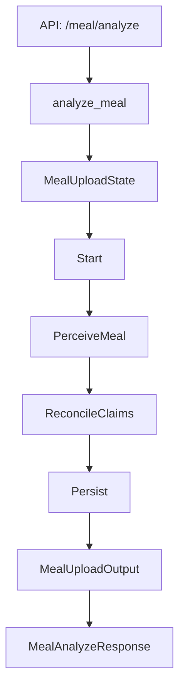

# Meal Analysis Workflow (Current Implementation)

This document describes the **current meal analysis flow as implemented in code**. It traces the request from the API entrypoint through the LangGraph workflow, the perception agent, normalization, persistence, and logging.

## Entry Points

### API Route
- `POST /api/v1/meal/analyze`
- File: `/Users/zhoufuwang/Projects/care_pilot/apps/api/carepilot_api/routers/meals.py`
- Delegates to `care_pilot.features.meals.api_service.analyze_meal`.

### API Orchestration (Validation + Workflow Kickoff)
- File: `/Users/zhoufuwang/Projects/care_pilot/src/care_pilot/features/meals/api_service.py`
- Key steps:
1. **Validate upload**
   - Enforce size (`meal_upload_max_bytes`), non-empty payload, and supported MIME types (`SUPPORTED_IMAGE_TYPES`).
2. **Preprocess image**
   - Optional downscale via `_maybe_downscale_image`.
3. **Build capture envelope**
   - Uses `build_capture_envelope` to create a capture record with request/correlation ids.
4. **Duplicate suppression**
   - `should_suppress_duplicate_capture(..., window_seconds=30)` can short-circuit with 409.
5. **Resolve provider**
   - Picks explicit provider or defaults using `settings.llm` capability map and fallback provider.
6. **Run workflow (LangGraph)**
   - `run_meal_upload_workflow(..., state=MealUploadState(...))`.
   - Timeout enforced via `settings.llm.inference.wall_clock_timeout_seconds`.
7. **Log completion**
   - `build_meal_analysis_log_payload` + `log_meal_analysis_event`.
8. **Return API response**
   - `MealAnalyzeResponse` returns raw observation, validated event, nutrition profile, output envelope, and workflow record.

## Workflow Graph (LangGraph)

- File: `/Users/zhoufuwang/Projects/care_pilot/src/care_pilot/features/meals/workflows/meal_upload_graph.py`
- Graph nodes: `Start -> PerceiveMeal -> ReconcileClaims -> Persist`.
- State: `MealUploadState` in `/Users/zhoufuwang/Projects/care_pilot/src/care_pilot/features/meals/workflows/meal_upload_state.py`.

### Node: Start
- Emits `workflow_started` via `WorkflowTraceEmitter`.
- Captures file metadata and correlation/request ids.

### Node: PerceiveMeal
- File: `.../meal_upload_graph.py` (PerceiveMeal node)
- Uses **HawkerVisionModule** to run perception and record a meal recognition record.
- Implementation:
  - `HawkerVisionModule.analyze_and_record(...)` in `/Users/zhoufuwang/Projects/care_pilot/src/care_pilot/agent/meal_analysis/vision_module.py`
  - Normalization via `normalize_vision_result(...)` in `/Users/zhoufuwang/Projects/care_pilot/src/care_pilot/features/meals/use_cases.py`.
  - Builds a `MealRecognitionRecord` using `build_meal_record(...)`.

#### Perception + Normalization
- **Perception** uses `pydantic_ai.Agent` with the `SYSTEM_PROMPT` for Singaporean cuisine.
- If inference engine v2 is enabled, it uses `InferenceEngine` + `InferenceRequest`.
- If confidence is too low or meal is not detected, a clarification `VisionResult` is returned by `build_clarification_response(...)`.
- **Normalization** produces:
  - `EnrichedMealEvent` (matched canonical foods, total nutrition, risk tags, unresolved items)
  - Updated `MealState`
  - `needs_manual_review` when:
    - unresolved items exist
    - low match confidence (< 0.7)
    - component mismatch risk tags
    - poor/fair image quality or low confidence

### Node: ReconcileClaims
- Extracts text-based claims from `meal_text` via `_extract_dietary_claims(...)`.
- Compares **user claims** vs **vision labels**.
- If both exist and disagree, it attempts arbitration via:
  - `arbitrate_meal_label(...)` in `/Users/zhoufuwang/Projects/care_pilot/src/care_pilot/agent/meal_analysis/arbitration.py`
- If arbitration resolves, it replaces perception labels; otherwise it records an unresolved conflict.
- Re-normalizes `VisionResult` after claim reconciliation.

### Node: Persist
- Builds and saves three canonical outputs:
  - `RawObservationBundle`
  - `ValidatedMealEvent`
  - `NutritionRiskProfile`
- Stores are written via `ctx.deps.stores.meals.*`.
- Builds an `AgentOutputEnvelope` using `build_meal_analysis_output(...)`.
- Emits `workflow_completed` with confidence, calories, model version, and manual review flags.
- Produces a `WorkflowExecutionResult` that includes trace events and handoffs.

#### Handoffs
- Always emits a handoff to `dietary_assessment_agent` with obligation `evaluate_meal_against_profile`.
- If `needs_manual_review`, emits an additional handoff to `notification_agent` with obligation `request_clarification_from_patient`.

## Output Types

### Core Output Contracts
- `MealUploadOutput`:
  - File: `/Users/zhoufuwang/Projects/care_pilot/src/care_pilot/features/meals/workflows/meal_upload_output.py`
  - Contains `raw_observation`, `validated_event`, `nutrition_profile`, `output_envelope`, `workflow`.

### API Response
- `MealAnalyzeResponse` is built from `MealUploadOutput` in `api_service.analyze_meal`.

## Persistence Targets

The workflow persists:
- `RawObservationBundle` (original perception + claims + context)
- `ValidatedMealEvent` (canonical meal event + confidence + provenance)
- `NutritionRiskProfile` (risk tags and nutrition totals)

These are saved via `AppStores.meals` in `Persist` node.

## Observability & Logging

- Workflow tracing:
  - `WorkflowTraceEmitter.workflow_started(...)`
  - `WorkflowTraceEmitter.workflow_completed(...)`
- Logging:
  - `build_meal_analysis_log_payload(...)`
  - `log_meal_analysis_event(...)`
- File: `/Users/zhoufuwang/Projects/care_pilot/src/care_pilot/features/meals/logging.py`

## Error & Guardrails Summary

- Upload errors (size, empty, invalid MIME) -> API 400/413
- Duplicate capture -> API 409
- Workflow timeout -> API 504
- If perception is low confidence or no meal detected -> clarification `VisionResult` with manual review
- Any missing intermediate state in the graph raises `ValueError`

## Key Files (Implementation Map)

- API route: `/Users/zhoufuwang/Projects/care_pilot/apps/api/carepilot_api/routers/meals.py`
- API orchestration: `/Users/zhoufuwang/Projects/care_pilot/src/care_pilot/features/meals/api_service.py`
- Workflow graph: `/Users/zhoufuwang/Projects/care_pilot/src/care_pilot/features/meals/workflows/meal_upload_graph.py`
- Workflow state/output:
  - `/Users/zhoufuwang/Projects/care_pilot/src/care_pilot/features/meals/workflows/meal_upload_state.py`
  - `/Users/zhoufuwang/Projects/care_pilot/src/care_pilot/features/meals/workflows/meal_upload_output.py`
- Vision module: `/Users/zhoufuwang/Projects/care_pilot/src/care_pilot/agent/meal_analysis/vision_module.py`
- Perception agent (direct agent helper): `/Users/zhoufuwang/Projects/care_pilot/src/care_pilot/agent/meal_analysis/meal_perception_agent.py`
- Arbitration agent: `/Users/zhoufuwang/Projects/care_pilot/src/care_pilot/agent/meal_analysis/arbitration.py`
- Normalization + records: `/Users/zhoufuwang/Projects/care_pilot/src/care_pilot/features/meals/use_cases.py`
- Domain models: `/Users/zhoufuwang/Projects/care_pilot/src/care_pilot/features/meals/domain/models.py`
- Logging: `/Users/zhoufuwang/Projects/care_pilot/src/care_pilot/features/meals/logging.py`

