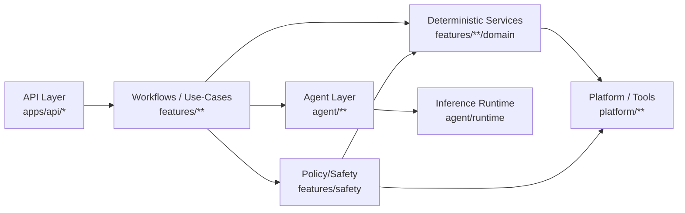

## 1) Diagnosis of Current Agent-Layer Problems

  Common failure modes

  - Fake “agents” that are really services (CRUD/rules/schedulers wrapped in an Agent name).
  - Agents doing deterministic business logic (eligibility, scheduling, nutrition math, policy) inside prompts or agent code.
  - Unclear workflows vs agents (multi-step journeys hidden inside “services” or agents).
  - LLM logic mixed with domain logic (prompting + parsing + model selection sprinkled across features/API).
  - Weak/untypeable contracts (free-form dict/string outputs → brittle downstream).
  - Hidden orchestration (services that chain tool→LLM→DB→notify without a declared workflow contract).
  - Poor observability (no consistent trace envelope: request_id/correlation_id, provider/model/capability, latency, retries, confidence).

  What likely applies here (and what I saw in-code)

  - The biggest practical risk is LLM/model plumbing leaking outside the agent layer (it already happened in at least one place and is now fixed by moving
    arbitration into dietary_guardian.agent).
  - Secondary risks: duplicated reasoning paths (meal reasoning vs chat vs recommendations), and “workflow-in-service” creep.

  ———

  ## 2) Design Principles

  - Agents own reasoning & interpretation (ambiguity, extraction, ranking, summarization, response drafting).
  - Domain services own deterministic business logic (rules, state transitions, persistence writes, scheduling).
  - Workflows coordinate multi-step product journeys (sequencing, idempotency, compensation, progress semantics).
  - Tools/adapters isolate infrastructure (LLM, OCR, search, storage, DB repos, notifications).
  - Contracts are typed and inspectable (Pydantic inputs/outputs; bounded JSON).
  - LLM calls are minimized + centralized (schema validation + retries + tracing at one boundary).
  - Deterministic policy/safety is the final gate (LLM proposes; policy decides).

  Standardization decisions (to make refactoring easier)

  - **Inference agents:** standardize on `pydantic_ai` for model-backed reasoning/extraction, invoked through the agent runtime (`src/dietary_guardian/agent/runtime/*`).
    - Rule: do not instantiate `pydantic_ai.Agent` or call provider factories directly outside `src/dietary_guardian/agent/**`.
  - **Workflows:** standardize on `pydantic-graph` for declared multi-step workflows (explicit steps + typed workflow state).
    - Rule: workflows orchestrate; they do not own domain rules, persistence, or scheduling logic.
  - **Determinism:** domain rules, persistence, and scheduling remain deterministic and live in `src/dietary_guardian/features/**/domain`.
  - **LangGraph:** explicitly deferred; reserve it for workflows that *require* checkpointed persistence, interrupts, or long-lived thread state.

  ———

  ## 3) Target Agent Layer Architecture

  What counts as an agent

  - Typed input → model-backed inference/judgment → typed output (+ confidence + trace), no durable writes.

  What does not count as an agent

  - CRUD/services, schedulers, repositories, notification delivery, workflow coordination, API request/response mapping.

  Where things go

  - API layer (apps/api/**): parse + auth + map to workflow entrypoints only.
  - Workflow/application (features/**): orchestrate steps; call services + agents; emit timeline events; handle idempotency.
  - Agent layer (agent/**): prompts + inference + structured outputs; may call read-only domain helpers.
  - Domain/service (features/**/domain): deterministic logic, persistence, scheduling, policy gates.
  - Platform (platform/**): external integrations + DB adapters + observability plumbing.

  ———

  ## 4) Recommended Agent Taxonomy

  - Perception agents: unstructured → structured facts (vision, prescription extraction, emotion signals).
  - Reasoning agents: structured context → assessments/proposals (dietary impact, adherence insights, recommendations).
  - Planning/orchestration agents: propose plans/questions only (rare; don’t execute).
  - Communication agents: structured proposals → user/clinician-facing language.
  - Safety/policy agents: usually avoid; keep policy deterministic (LLM critique can be non-authoritative).

  Recommendation: use perception + reasoning + communication; keep planning optional; keep safety deterministic.

  ———

  ## 5) Proposed Agent Inventory for This System (minimal, high-leverage)

  | Agent | Purpose | Inputs | Outputs | Allowed to call | Must NOT own |
  |---|---|---|---|---|---|
  | MealPerception / MealAnalysis Agent | Meal photo → structured meal perception | image (+ optional caption), locale, trace | perception items, portions,
  evidence, confidence | inference runtime; read-only food lookup | persistence orchestration; nutrition math |
  | DietaryAssessment Agent | Meal + profile → risks + suggestions | validated meal, health profile, constraints | risk flags, severity, suggested actions |
  inference runtime; read-only safety context | policy enforcement; DB writes |
  | PrescriptionExtraction Agent | doc → regimen draft | PDF/image/text + locale | medications, dosage, schedule draft, ambiguities | OCR/LLM tools; med
  normalization (read-only) | reminder scheduling; persistence |
  | MedicationAdherenceInsight Agent (optional) | adherence history → intervention proposals | regimen + adherence events + prefs | issues, causes, nudges |
  deterministic adherence summaries | scheduling; delivery |
  | EmotionInference Agent | text/audio → emotion signal | text/audio + language + context features | label + confidence + signals | emotion runtime | response
  generation |
  | RecommendationSynthesis Agent | snapshot → ranked recommendation cards | CaseSnapshot + timeline | cards + rationale + confidence | trend services
  (deterministic), inference if needed | notifications; durable writes |
  | CompanionResponse Agent | draft user-facing reply | message + snapshot + proposals + policy/tool specs | message + structured “actions” | inference runtime
  only | tool execution; persistence; policy |

  ———

  ## 6) Refactored Layer Boundaries (sharp rules)

  Agent layer (src/dietary_guardian/agent/**)

  - MUST: return typed outputs; include confidence/warnings/errors; never write durable state.
  - MUST NOT: call repos directly; schedule notifications; orchestrate multi-step journeys; use HTTP types.

  Workflow/application (src/dietary_guardian/features/**)

  - MUST: own sequencing + idempotency + compensation + timeline emission.
  - MUST NOT: instantiate pydantic_ai.Agent or call LLMFactory.get_model() directly (enforced by tests/meta/test_agent_layer_boundaries.py).

  Domain/service (src/dietary_guardian/features/**/domain)

  - MUST: deterministic + unit-testable; own state transitions + persistence writes.
  - MUST NOT: prompts/LLM calls/schema parsing from LLM text.

  Platform/infrastructure (src/dietary_guardian/platform/**)

  - MUST: infra-only; provide ports/adapters; no feature/agent imports.

  ———

  ## 7) Optimized Execution Flow

  Meal photo upload

  1. API → Meal workflow (validate/store/dedupe) [deterministic]
  2. MealAnalysisAgent (vision extraction) [reasoning/perception]
  3. Domain normalize + nutrition calc + persist meal [deterministic]
  4. DietaryAssessmentAgent (risk/suggestions) [reasoning]
  5. Policy gate + emit timeline/notifications plan [deterministic]

  Prescription upload + reminders

  1. API → Medication workflow (store doc metadata) [deterministic]
  2. PrescriptionExtractionAgent [reasoning/perception]
  3. Domain validate/normalize + persist regimen [deterministic]
  4. Domain generate reminder schedule + persist + outbox [deterministic]
  5. Optional adherence insight agent [reasoning]

  Emotion-aware companion reply

  1. Persist user message immediately [deterministic]
  2. EmotionInference sidecar [reasoning/perception]
  3. Snapshot/memory/tool-policy assembly [deterministic]
  4. Recommendation synthesis (only if triggered) [reasoning]
  5. Companion response generation [reasoning/communication]
  6. Policy gate + persist assistant message + emit timeline [deterministic]

  Proactive recommendation

  1. Deterministic triggers (missed meds, anomalies, inactivity)
  2. Recommendation synthesis [reasoning]
  3. Policy + channel + rate limit [deterministic]
  4. Outbox/notifications [deterministic]

  ———

  ## 8) JSON / Contract Design

  - Agents return bounded JSON via Pydantic outputs (no free-form dicts/strings as primary output).
  - Validation happens at the inference boundary (centralized retries + schema enforcement).
  - Include trace metadata: request_id, correlation_id, capability/provider/model/endpoint, latency_ms, retry count (where available).
  - Confidence scores are explicit [0,1] and used to trigger clarifying questions or fallback paths.
  - Errors are structured (code, message, retryable) and never leak raw exceptions across layers.

  Result: reliability, debuggability, safer iteration, cheaper inference (fewer calls, better caching eligibility).

  ———

  ## 9) Folder / Module Refactor (opinionated)

  Keep the modular-monolith “feature-first” layout:

  - src/dietary_guardian/agent/ — only model-powered reasoning/interpretation + runtime
  - src/dietary_guardian/features/ — workflows + deterministic domain behavior
  - src/dietary_guardian/platform/ — infra adapters (DB/storage/queue/notifications/observability)

  Within agent:

  - core/ contracts, runtime/ inference plumbing
  - meal_analysis/, dietary/, emotion/, recommendation/, chat/
  - add small, typed helpers under the relevant agent package (example added: meal label arbitration)

  ———

  ## 10) Migration Plan

  Phase 1 — hackathon cleanup

  - Enforce “no model plumbing outside agent layer” (done for meals arbitration + test guardrail).
  - Inventory existing “agents” and rename/move any fake agents into services/workflows.
  - Consolidate duplicated prompts into single agent entrypoints.

  Phase 2 — stronger architecture

  - Add import-boundary tests for platform purity (platform must not import features/agent).
  - Add golden contract tests per agent (schema, confidence thresholds, failure modes).
  - Add caching/memoization for expensive inference (vision, summarization).

  Phase 3 — long-term evolution

  - Offline evaluation harness + regression datasets.
  - Capability routing + budgets per workflow (cost controls).
  - Clinician-grade audit trails for recommendations and safety flags.

  ———

  ## 11) Final Recommended Architecture (with diagram)

  Stance: API thin → workflows coordinate → agents reason → services decide/write → tools integrate.

